# LynxFramework 系统设计文档

> **版本**：v1.1 Complete
> **目标引擎**：Godot 4.6.3 (C# / .NET 8 + GDScript)
> **设计原则**：稳定内核不热更（性能优先），逻辑层支持热更新（灵活性优先），模块间零强依赖（通过 EventBus / 接口解耦）
> **实现状态**：Phase 1-8 全部完成（含 C#/GDScript 桥接层）

---

## 目录

1. [架构总览](#1-架构总览)
2. [核心基础设施](#2-核心基础设施)
3. [资源与对象管理](#3-资源与对象管理)
4. [服务层](#4-服务层)
5. [场景与世界](#5-场景与世界)
6. [UI 系统](#6-ui-系统)
7. [音频与输入](#7-音频与输入)
8. [网络](#8-网络)
9. [实体与流程](#9-实体与流程)
10. [摄像机](#10-摄像机)
11. [存档系统](#11-存档系统)
12. [调试与热更新](#12-调试与热更新)
13. [跨模块交互流程](#13-跨模块交互流程)
14. [实现路线图](#14-实现路线图)

---

## 1. 架构总览

### 1.1 分层架构

```
┌─────────────────────────────────────────────────────────┐
│                    游戏逻辑层 (可热更)                      │
│  Procedure 脚本 │ Entity 行为 │ UI 脚本 │ 配置表/翻译文件   │
├─────────────────────────────────────────────────────────┤
│                    框架服务层 (可热更)                      │
│  UIModule │ AudioModule │ InputModule │ InputBuffer      │
│  DataTableModule │ LocalizationModule │ GameSettings     │
│  SceneModule │ CameraModule │ SaveModule(迁移脚本)        │
├─────────────────────────────────────────────────────────┤
│                    框架内核层 (稳定不热更)                   │
│  FrameworkEntry │ ModuleManager │ EventBus │ UpdateDriver│
│  PoolManager │ ResourceService │ LogService              │
│  NetworkModule(连接) │ HotUpdateModule(下载) │ SaveModule│
│  WorldStreamingModule(调度器) │ DebugModule │ EntityModule│
├─────────────────────────────────────────────────────────┤
│                    Godot Engine 4.x                      │
└─────────────────────────────────────────────────────────┘
```

### 1.2 模块依赖关系


```mermaid
graph TB
    FE[FrameworkEntry] --> MM[ModuleManager]
    FE --> UD[UpdateDriver]
    FE --> HU[HotUpdateModule]

    MM --> EB[EventBus]
    MM --> LS[LogService]
    MM --> PM[PoolManager]
    MM --> RS[ResourceService]

    SM[SceneModule] --> RS
    SM --> PM
    SM --> EB

    WS[WorldStreamingModule] --> RS
    WS --> PM
    WS --> EM[EntityModule]
    WS --> EB

    UI[UIModule] --> RS
    UI --> PM
    UI --> EB

    AM[AudioModule] --> RS
    AM --> EB

    IM[InputModule] --> EB
    IB[InputBufferModule] --> IM
    IB --> EB

    EM --> PM
    EM --> EB

    PROC[ProcedureModule] --> EB
    PROC --> SM

    CAM[CameraModule] --> EB

    NET[NetworkModule] --> EB
    NET --> LS

    SAVE[SaveModule] --> LS
    SAVE --> EB

    GS[GameSettingsModule] --> EB
    GS --> SAVE
    GS --> IM

    DT[DataTableModule] --> RS
    DT --> EB

    LOC[LocalizationModule] --> RS
    LOC --> EB

    DM[DebugModule] --> EB
    DM --> LS
    DM --> PM

    HU --> RS
    HU --> LS
    HU --> EB

    style FE fill:#e74c3c,color:#fff
    style MM fill:#e74c3c,color:#fff
    style EB fill:#e74c3c,color:#fff
    style UD fill:#e74c3c,color:#fff
    style PM fill:#e67e22,color:#fff
    style RS fill:#e67e22,color:#fff
    style LS fill:#e67e22,color:#fff
```

> 红色 = 内核层，橙色 = 资源/基础设施层，其余 = 服务层

### 1.3 命名空间规划

| 命名空间 | 职责 |
|---------|------|
| `LynxFramework` | 核心接口 (IModule, IUpdatable)、FrameworkEntry |
| `LynxFramework.Core` | ModuleManager, EventBus, UpdateDriver |
| `LynxFramework.Pool` | PoolManager, 对象池实现 |
| `LynxFramework.Resource` | ResourceService, ResourceRequest |
| `LynxFramework.Log` | LogService, LogLevel |
| `LynxFramework.Settings` | GameSettingsModule |
| `LynxFramework.Data` | DataTableModule, DataTable |
| `LynxFramework.Localization` | LocalizationModule |
| `LynxFramework.Scene` | SceneModule, ISceneTransition |
| `LynxFramework.Streaming` | WorldStreamingModule |
| `LynxFramework.UI` | UIModule, IUIPanel, IUITransition |
| `LynxFramework.Audio` | AudioModule |
| `LynxFramework.Input` | InputModule, InputBufferModule |
| `LynxFramework.Network` | NetworkModule, IProtocolHandler |
| `LynxFramework.Entity` | EntityModule, IEntity |
| `LynxFramework.Procedure` | ProcedureModule, IProcedure |
| `LynxFramework.Camera` | CameraModule |
| `LynxFramework.Save` | SaveModule, ISaveMigration |
| `LynxFramework.Debug` | DebugModule |
| `LynxFramework.HotUpdate` | HotUpdateModule |

### 1.4 热更边界定义

| 模块 | 内核(稳定) | 逻辑(可热更) |
|------|-----------|-------------|
| EventBus | 回调调度、类型安全机制 | 无 |
| PoolManager | 池分配/回收核心 | 无 |
| ResourceService | 异步加载、缓存、.pck 挂载 | 无 |
| NetworkModule | 连接/重连/心跳 | IProtocolHandler 编解码 |
| WorldStreamingModule | 加载调度器 | 区块加载策略脚本 |
| EntityModule | 生成/回收调度 | 实体行为脚本 (AI、技能) |
| ProcedureModule | FSM 切换核心 | IProcedure 流程脚本 |
| SaveModule | 读写/加密核心 | ISaveMigration 迁移脚本 |
| HotUpdateModule | 下载/应用/回滚核心 | 版本检测策略 |
| UIModule | 栈管理/生命周期调度 | UI 面板脚本与布局资源 |
| AudioModule | 播放器管理 | 音频资源配置 |
| InputModule | 事件转发核心 | InputMap 键位绑定 |
| InputBufferModule | 缓冲窗口核心 | 缓冲逻辑脚本 |
| DataTableModule | 表加载/查询核心 | 表格数据文件 |
| LocalizationModule | 翻译查找核心 | 翻译资源文件 |
| GameSettingsModule | 存取/通知核心 | 配置项注册 |
| SceneModule | 加载/卸载/切换核心 | .tscn 场景文件 |
| CameraModule | 跟随/震动/混合核心 | 无 |

---

## 2. 核心基础设施

### 2.1 FrameworkEntry

**职责**：Autoload 单例，框架启动入口，按顺序初始化所有模块。

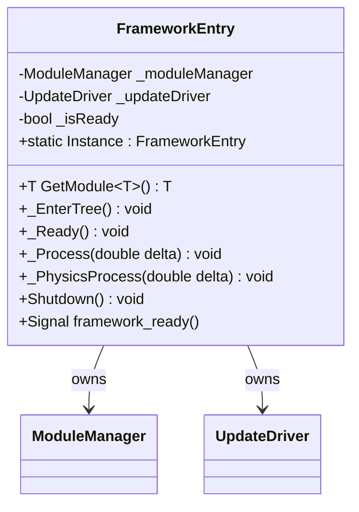
```mermaid
classDiagram
    class FrameworkEntry {
        -ModuleManager _moduleManager
        -UpdateDriver _updateDriver
        -bool _isReady
        +static Instance : FrameworkEntry
        +T GetModule~T~() T
        +_EnterTree() void
        +_Ready() void
        +_Process(double delta) void
        +_PhysicsProcess(double delta) void
        +Shutdown() void
        +Signal framework_ready()
    }
    FrameworkEntry --> ModuleManager : owns
    FrameworkEntry --> UpdateDriver : owns
```

**类定义**：

```csharp
// LynxFramework/FrameworkEntry.cs
public partial class FrameworkEntry : Node
{
    public static FrameworkEntry Instance { get; private set; }

    private ModuleManager _moduleManager;
    private UpdateDriver _updateDriver;
    private bool _isReady;

    [Signal]
    public delegate void FrameworkReadyEventHandler();

    public override void _EnterTree()
    {
        Instance = this;
        _moduleManager = new ModuleManager();
    }

    public override void _Ready()
    {
        // 1. 检查热更新回滚标记
        CheckRollbackFlag();

        // 2. 按优先级注册所有模块
        RegisterBuiltinModules();

        // 3. 初始化所有模块
        _moduleManager.InitAll();

        // 4. 获取 UpdateDriver 引用并启动驱动
        _updateDriver = _moduleManager.GetModule<UpdateDriver>();
        _updateDriver?.Start();

        _isReady = true;
        EmitSignal(SignalName.FrameworkReady);
    }

    public override void _Process(double delta)
    {
        if (!_isReady) return;
        _updateDriver?.DriveProcess((float)delta);
    }

    public override void _PhysicsProcess(double delta)
    {
        if (!_isReady) return;
        _updateDriver?.DrivePhysicsProcess((float)delta);
    }

    public T GetModule<T>() where T : IModule => _moduleManager.GetModule<T>();

    public void Shutdown()
    {
        _updateDriver?.Stop();
        _moduleManager.ShutdownAll();
        _isReady = false;
    }

    private void CheckRollbackFlag()
    {
        // 读取 user://hotupdate_rollback 标记
        // 若存在则调用 HotUpdateModule.RecoverLastVersion()
    }

    private void RegisterBuiltinModules()
    {
        // 按 Priority 升序注册
        _moduleManager.RegisterModule(new EventBus());          // 0
        _moduleManager.RegisterModule(new LogService());        // 10
        _moduleManager.RegisterModule(new ResourceService());   // 20
        _moduleManager.RegisterModule(new PoolManager());       // 30
        _moduleManager.RegisterModule(new UpdateDriver());      // 40
        _moduleManager.RegisterModule(new GameSettingsModule());// 50
        _moduleManager.RegisterModule(new DataTableModule());   // 60
        _moduleManager.RegisterModule(new LocalizationModule());// 70
        _moduleManager.RegisterModule(new InputModule());       // 80
        _moduleManager.RegisterModule(new InputBufferModule()); // 90
        _moduleManager.RegisterModule(new AudioModule());       // 100
        _moduleManager.RegisterModule(new NetworkModule());     // 110
        _moduleManager.RegisterModule(new SceneModule());       // 120
        _moduleManager.RegisterModule(new UIModule());          // 130
        _moduleManager.RegisterModule(new CameraModule());      // 140
        _moduleManager.RegisterModule(new EntityModule());      // 150
        _moduleManager.RegisterModule(new WorldStreamingModule()); // 160
        _moduleManager.RegisterModule(new ProcedureModule());   // 170
        _moduleManager.RegisterModule(new SaveModule());        // 180
        _moduleManager.RegisterModule(new DebugModule());       // 190
        _moduleManager.RegisterModule(new HotUpdateModule());   // 200
    }
}
```

**启动时序图**：

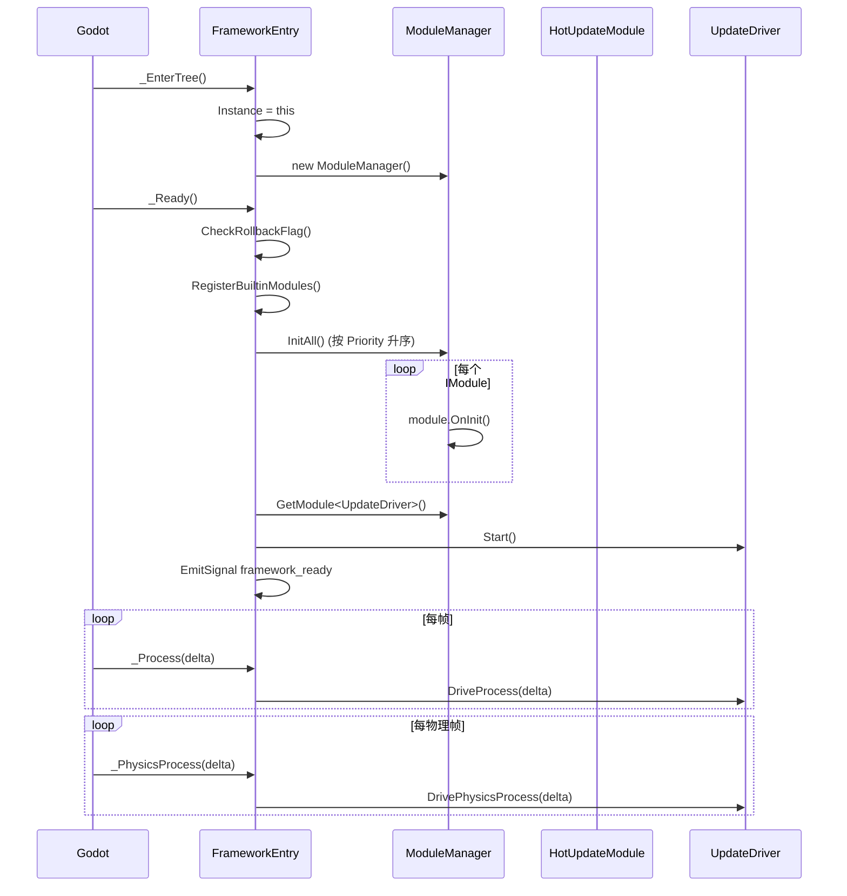
```mermaid
sequenceDiagram
    participant Godot
    participant FE as FrameworkEntry
    participant MM as ModuleManager
    participant HU as HotUpdateModule
    participant UD as UpdateDriver

    Godot->>FE: _EnterTree()
    FE->>FE: Instance = this
    FE->>MM: new ModuleManager()

    Godot->>FE: _Ready()
    FE->>FE: CheckRollbackFlag()
    FE->>FE: RegisterBuiltinModules()
    FE->>MM: InitAll() (按 Priority 升序)
    loop 每个 IModule
        MM->>MM: module.OnInit()
    end
    FE->>MM: GetModule<UpdateDriver>()
    FE->>UD: Start()
    FE->>FE: EmitSignal framework_ready

    loop 每帧
        Godot->>FE: _Process(delta)
        FE->>UD: DriveProcess(delta)
    end

    loop 每物理帧
        Godot->>FE: _PhysicsProcess(delta)
        FE->>UD: DrivePhysicsProcess(delta)
    end
```

### 2.2 ModuleManager

**职责**：模块注册、查询、生命周期管理。

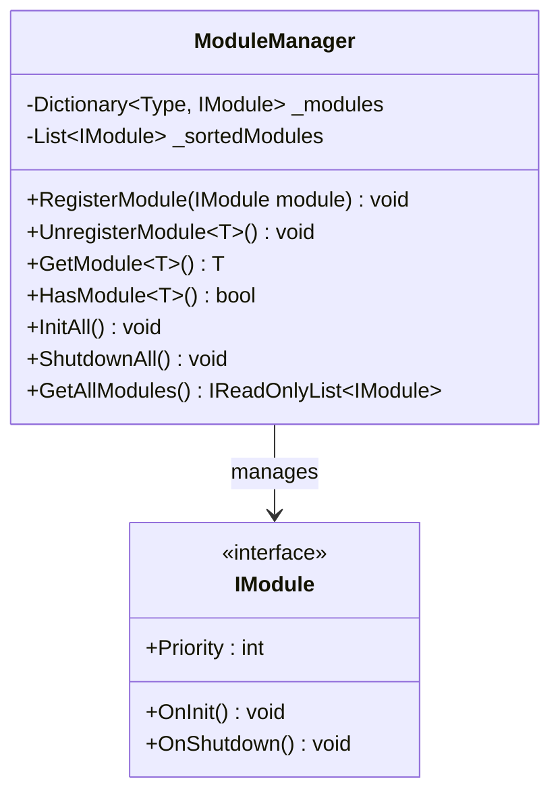
```mermaid
classDiagram
    class IModule {
        <<interface>>
        +Priority : int
        +OnInit() void
        +OnShutdown() void
    }

    class ModuleManager {
        -Dictionary~Type, IModule~ _modules
        -List~IModule~ _sortedModules
        +RegisterModule(IModule module) void
        +UnregisterModule~T~() void
        +GetModule~T~() T
        +HasModule~T~() bool
        +InitAll() void
        +ShutdownAll() void
        +GetAllModules() IReadOnlyList~IModule~
    }

    ModuleManager --> IModule : manages
```

**接口定义**：

```csharp
// LynxFramework/IModule.cs
public interface IModule
{
    /// <summary>初始化优先级，值越小越先初始化</summary>
    int Priority { get; }

    /// <summary>模块初始化，在 FrameworkEntry._Ready() 中按优先级调用</summary>
    void OnInit();

    /// <summary>模块关闭，在 ShutdownAll() 中按优先级逆序调用</summary>
    void OnShutdown();
}
```

**类定义**：

```csharp
// LynxFramework/Core/ModuleManager.cs
public class ModuleManager
{
    private readonly Dictionary<Type, IModule> _modules = new();
    private List<IModule> _sortedModules;

    public void RegisterModule(IModule module)
    {
        var type = module.GetType();
        if (_modules.ContainsKey(type))
            throw new InvalidOperationException($"Module {type.Name} already registered.");

        _modules[type] = module;
        _sortedModules = null; // 标记需要重新排序
    }

    public void UnregisterModule<T>() where T : IModule
    {
        _modules.Remove(typeof(T));
        _sortedModules = null;
    }

    public T GetModule<T>() where T : IModule
    {
        return _modules.TryGetValue(typeof(T), out var module) ? (T)module : default;
    }

    public bool HasModule<T>() where T : IModule => _modules.ContainsKey(typeof(T));

    public void InitAll()
    {
        EnsureSorted();
        foreach (var module in _sortedModules)
            module.OnInit();
    }

    public void ShutdownAll()
    {
        EnsureSorted();
        for (int i = _sortedModules.Count - 1; i >= 0; i--)
            _sortedModules[i].OnShutdown();
    }

    public IReadOnlyList<IModule> GetAllModules()
    {
        EnsureSorted();
        return _sortedModules;
    }

    private void EnsureSorted()
    {
        _sortedModules ??= _modules.Values.OrderBy(m => m.Priority).ToList();
    }
}
```

### 2.3 EventBus

**职责**：高性能全局事件发布/订阅，类型安全载荷，替代模块间强依赖。

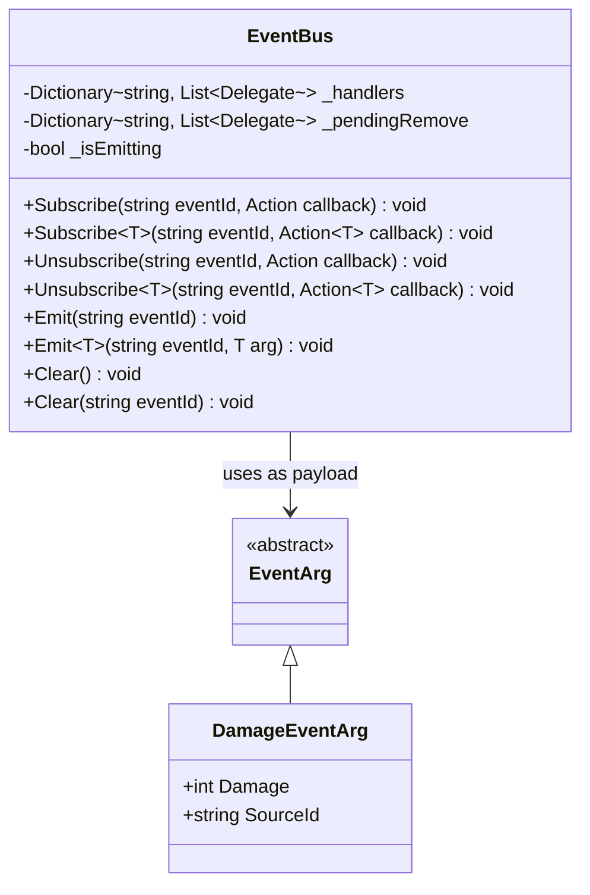
```mermaid
classDiagram
    class EventArg {
        <<abstract>>
    }

    class EventBus {
        -Dictionary~string, List~Delegate~~ _handlers
        -Dictionary~string, List~Delegate~~ _pendingRemove
        -bool _isEmitting
        +Subscribe(string eventId, Action callback) void
        +Subscribe~T~(string eventId, Action~T~ callback) void
        +Unsubscribe(string eventId, Action callback) void
        +Unsubscribe~T~(string eventId, Action~T~ callback) void
        +Emit(string eventId) void
        +Emit~T~(string eventId, T arg) void
        +Clear() void
        +Clear(string eventId) void
    }

    EventBus --> EventArg : uses as payload

    class DamageEventArg {
        +int Damage
        +string SourceId
    }
    EventArg <|-- DamageEventArg
```

**类定义**：

```csharp
// LynxFramework/Core/EventBus.cs
// 注意：使用 Godot.Resource 全限定名，避免与 LynxFramework.Resource 命名空间冲突。
public partial class EventArg : Godot.Resource { }

public class EventBus : IModule
{
    private readonly Dictionary<string, List<Delegate>> _handlers = new();
    private readonly Dictionary<string, List<Delegate>> _pendingAdd = new();
    private readonly HashSet<(string eventId, Delegate handler)> _pendingRemove = new();
    private bool _isEmitting;

    public int Priority => 0;

    public void OnInit() { }
    public void OnShutdown() => Clear();

    // --- 订阅 ---
    public void Subscribe(string eventId, Action callback)
        => AddHandler(eventId, callback);

    public void Subscribe<T>(string eventId, Action<T> callback) where T : EventArg
        => AddHandler(eventId, callback);

    // --- 取消订阅 ---
    public void Unsubscribe(string eventId, Action callback)
        => RemoveHandler(eventId, callback);

    public void Unsubscribe<T>(string eventId, Action<T> callback) where T : EventArg
        => RemoveHandler(eventId, callback);

    // --- 发射 ---
    public void Emit(string eventId)
    {
        BeginEmit();
        try
        {
            if (_handlers.TryGetValue(eventId, out var list))
            {
                for (int i = 0; i < list.Count; i++)
                    ((Action)list[i])();
            }
        }
        finally { EndEmit(); }
    }

    public void Emit<T>(string eventId, T arg) where T : EventArg
    {
        BeginEmit();
        try
        {
            if (_handlers.TryGetValue(eventId, out var list))
            {
                for (int i = 0; i < list.Count; i++)
                    ((Action<T>)list[i])(arg);
            }
        }
        finally { EndEmit(); }
    }

    public void Clear()
    {
        _handlers.Clear();
        _pendingAdd.Clear();
        _pendingRemove.Clear();
    }

    public void Clear(string eventId)
    {
        _handlers.Remove(eventId);
        _pendingAdd.Remove(eventId);
        _pendingRemove.RemoveWhere(t => t.eventId == eventId);
    }

    // --- 内部 ---
    private void AddHandler(string eventId, Delegate handler)
    {
        if (_isEmitting)
        {
            if (!_pendingAdd.TryGetValue(eventId, out var list))
            {
                list = new List<Delegate>();
                _pendingAdd[eventId] = list;
            }
            list.Add(handler);
        }
        else
        {
            if (!_handlers.TryGetValue(eventId, out var list))
            {
                list = new List<Delegate>();
                _handlers[eventId] = list;
            }
            list.Add(handler);
        }
    }

    private void RemoveHandler(string eventId, Delegate handler)
    {
        if (_isEmitting)
            _pendingRemove.Add((eventId, handler));
        else if (_handlers.TryGetValue(eventId, out var list))
            list.Remove(handler);
    }

    private void BeginEmit() => _isEmitting = true;

    private void EndEmit()
    {
        _isEmitting = false;
        // 处理延迟添加
        foreach (var kv in _pendingAdd)
        {
            if (!_handlers.TryGetValue(kv.Key, out var list))
            {
                list = new List<Delegate>();
                _handlers[kv.Key] = list;
            }
            list.AddRange(kv.Value);
        }
        _pendingAdd.Clear();
        // 处理延迟移除
        foreach (var (eventId, handler) in _pendingRemove)
        {
            if (_handlers.TryGetValue(eventId, out var list))
                list.Remove(handler);
        }
        _pendingRemove.Clear();
    }
}
```

**设计要点**：
- Emit 过程中禁止直接修改回调列表，通过 `_pendingAdd` / `_pendingRemove` 延迟处理，避免迭代时修改集合异常
- 类型安全载荷通过泛型 `Action<T> where T : EventArg` 约束，编译期检查参数类型
- 同一 eventId 支持无参 `Action` 和带参 `Action<T>` 两种回调共存

### 2.4 UpdateDriver

**职责**：统一主循环调度，支持 PROCESS / PHYSICS_PROCESS 两种阶段与优先级排序。

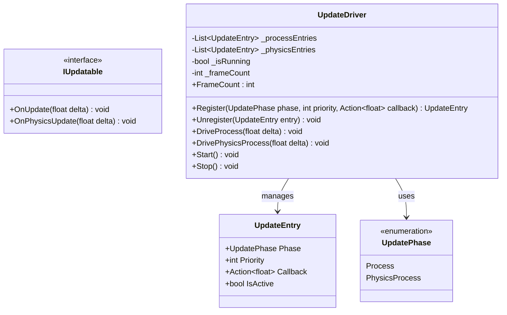
```mermaid
classDiagram
    class UpdatePhase {
        <<enumeration>>
        Process
        PhysicsProcess
    }

    class UpdateEntry {
        +UpdatePhase Phase
        +int Priority
        +Action~float~ Callback
        +bool IsActive
    }

    class IUpdatable {
        <<interface>>
        +OnUpdate(float delta) void
        +OnPhysicsUpdate(float delta) void
    }

    class UpdateDriver {
        -List~UpdateEntry~ _processEntries
        -List~UpdateEntry~ _physicsEntries
        -bool _isRunning
        -int _frameCount
        +Register(UpdatePhase phase, int priority, Action~float~ callback) UpdateEntry
        +Unregister(UpdateEntry entry) void
        +DriveProcess(float delta) void
        +DrivePhysicsProcess(float delta) void
        +Start() void
        +Stop() void
        +FrameCount : int
    }

    UpdateDriver --> UpdateEntry : manages
    UpdateDriver --> UpdatePhase : uses
```

**类定义**：

```csharp
// LynxFramework/Core/UpdateDriver.cs
public enum UpdatePhase
{
    Process,
    PhysicsProcess
}

public sealed class UpdateEntry
{
    public UpdatePhase Phase;
    public int Priority;
    public Action<float> Callback;
    public bool IsActive = true;
}

public class UpdateDriver : IModule
{
    private readonly List<UpdateEntry> _processEntries = new();
    private readonly List<UpdateEntry> _physicsEntries = new();
    private bool _dirty = true;
    private bool _isRunning;

    public int Priority => 40;
    public int FrameCount { get; private set; }

    public void OnInit() { }
    public void OnShutdown() => Stop();

    public UpdateEntry Register(UpdatePhase phase, int priority, Action<float> callback)
    {
        var entry = new UpdateEntry { Phase = phase, Priority = priority, Callback = callback };
        var list = phase == UpdatePhase.Process ? _processEntries : _physicsEntries;
        list.Add(entry);
        _dirty = true;
        return entry;
    }

    public void Unregister(UpdateEntry entry)
    {
        var list = entry.Phase == UpdatePhase.Process ? _processEntries : _physicsEntries;
        list.Remove(entry);
    }

    public void DriveProcess(float delta)
    {
        if (!_isRunning) return;
        EnsureSorted();
        FrameCount++;
        for (int i = 0; i < _processEntries.Count; i++)
        {
            if (_processEntries[i].IsActive)
                _processEntries[i].Callback(delta);
        }
    }

    public void DrivePhysicsProcess(float delta)
    {
        if (!_isRunning) return;
        EnsureSorted();
        for (int i = 0; i < _physicsEntries.Count; i++)
        {
            if (_physicsEntries[i].IsActive)
                _physicsEntries[i].Callback(delta);
        }
    }

    public void Start() => _isRunning = true;
    public void Stop() => _isRunning = false;

    private void EnsureSorted()
    {
        if (!_dirty) return;
        _processEntries.Sort((a, b) => a.Priority.CompareTo(b.Priority));
        _physicsEntries.Sort((a, b) => a.Priority.CompareTo(b.Priority));
        _dirty = false;
    }
}
```

**设计要点**：
- 返回 `UpdateEntry` 句柄，调用方可通过 `entry.IsActive = false` 暂停或 `Unregister` 完全移除
- 排序仅在注册变更时触发（脏标记），避免每帧排序开销
- `IUpdatable` 接口作为可选便利接口，模块可选择实现它或直接注册回调

---

## 3. 资源与对象管理

### 3.1 PoolManager

**职责**：管理节点池与普通对象池，降低 GC 压力，提供池化分配/回收。

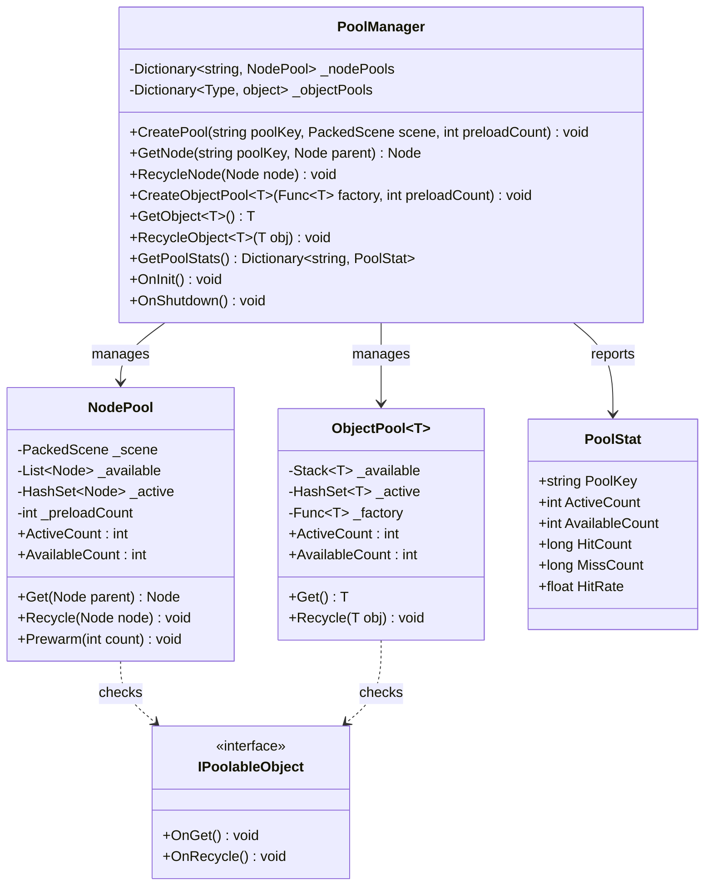
```mermaid
classDiagram
    class IPoolableObject {
        <<interface>>
        +OnGet() void
        +OnRecycle() void
    }

    class NodePool {
        -PackedScene _scene
        -List~Node~ _available
        -HashSet~Node~ _active
        -int _preloadCount
        +Get(Node parent) Node
        +Recycle(Node node) void
        +Prewarm(int count) void
        +ActiveCount : int
        +AvailableCount : int
    }

    class ObjectPool~T~ {
        -Stack~T~ _available
        -HashSet~T~ _active
        -Func~T~ _factory
        +Get() T
        +Recycle(T obj) void
        +ActiveCount : int
        +AvailableCount : int
    }

    class PoolManager {
        -Dictionary~string, NodePool~ _nodePools
        -Dictionary~Type, object~ _objectPools
        +CreatePool(string poolKey, PackedScene scene, int preloadCount) void
        +GetNode(string poolKey, Node parent) Node
        +RecycleNode(Node node) void
        +CreateObjectPool~T~(Func~T~ factory, int preloadCount) void
        +GetObject~T~() T
        +RecycleObject~T~(T obj) void
        +GetPoolStats() Dictionary~string, PoolStat~
        +OnInit() void
        +OnShutdown() void
    }

    class PoolStat {
        +string PoolKey
        +int ActiveCount
        +int AvailableCount
        +long HitCount
        +long MissCount
        +float HitRate
    }

    PoolManager --> NodePool : manages
    PoolManager --> ObjectPool : manages
    PoolManager --> PoolStat : reports
    NodePool ..> IPoolableObject : checks
    ObjectPool ..> IPoolableObject : checks
```

**类定义**：

```csharp
// LynxFramework/Pool/IPoolableObject.cs
public interface IPoolableObject
{
    void OnGet();
    void OnRecycle();
}

// LynxFramework/Pool/NodePool.cs
public sealed class NodePool
{
    private readonly PackedScene _scene;
    private readonly List<Node> _available = new();
    private readonly HashSet<Node> _active = new();
    private long _hitCount;
    private long _missCount;

    public NodePool(PackedScene scene, int preloadCount)
    {
        _scene = scene;
        Prewarm(preloadCount);
    }

    public Node Get(Node parent)
    {
        Node node;
        if (_available.Count > 0)
        {
            node = _available[_available.Count - 1];
            _available.RemoveAt(_available.Count - 1);
            _hitCount++;
        }
        else
        {
            node = _scene.Instantiate();
            _missCount++;
        }

        _active.Add(node);
        parent?.AddChild(node);

        if (node is IPoolableObject poolable)
            poolable.OnGet();

        return node;
    }

    public void Recycle(Node node)
    {
        if (!_active.Remove(node)) return;

        if (node is IPoolableObject poolable)
            poolable.OnRecycle();

        node.GetParent()?.RemoveChild(node);
        _available.Add(node);
    }

    public void Prewarm(int count)
    {
        for (int i = 0; i < count; i++)
        {
            var node = _scene.Instantiate();
            _available.Add(node);
        }
    }

    public int ActiveCount => _active.Count;
    public int AvailableCount => _available.Count;
    public long HitCount => _hitCount;
    public long MissCount => _missCount;
    public float HitRate => (_hitCount + _missCount) == 0 ? 0 : (float)_hitCount / (_hitCount + _missCount);
}

// LynxFramework/Pool/ObjectPool.cs
public sealed class ObjectPool<T> where T : class, IPoolableObject, new()
{
    private readonly Stack<T> _available = new();
    private readonly HashSet<T> _active = new();
    private readonly Func<T> _factory;

    public ObjectPool(Func<T> factory = null, int preloadCount = 0)
    {
        _factory = factory ?? (() => new T());
        for (int i = 0; i < preloadCount; i++)
            _available.Push(_factory());
    }

    public T Get()
    {
        var obj = _available.Count > 0 ? _available.Pop() : _factory();
        _active.Add(obj);
        obj.OnGet();
        return obj;
    }

    public void Recycle(T obj)
    {
        if (!_active.Remove(obj)) return;
        obj.OnRecycle();
        _available.Push(obj);
    }

    public int ActiveCount => _active.Count;
    public int AvailableCount => _available.Count;
}

// LynxFramework/Pool/PoolManager.cs
public class PoolManager : IModule
{
    private readonly Dictionary<string, NodePool> _nodePools = new();
    private readonly Dictionary<Type, object> _objectPools = new();

    public int Priority => 30;
    public void OnInit() { }
    public void OnShutdown()
    {
        foreach (var pool in _nodePools.Values)
        {
            // 释放所有节点
        }
        _nodePools.Clear();
        _objectPools.Clear();
    }

    public void CreatePool(string poolKey, PackedScene scene, int preloadCount = 0)
        => _nodePools[poolKey] = new NodePool(scene, preloadCount);

    public Node GetNode(string poolKey, Node parent = null)
        => _nodePools.TryGetValue(poolKey, out var pool) ? pool.Get(parent) : null;

    public void RecycleNode(Node node)
    {
        // 通过节点元数据或组查找所属池
        if (node.HasMeta("pool_key"))
        {
            var key = node.GetMeta("pool_key").AsString();
            if (_nodePools.TryGetValue(key, out var pool))
                pool.Recycle(node);
        }
    }

    public void CreateObjectPool<T>(Func<T> factory = null, int preloadCount = 0) where T : class, IPoolableObject, new()
        => _objectPools[typeof(T)] = new ObjectPool<T>(factory, preloadCount);

    public T GetObject<T>() where T : class, IPoolableObject, new()
        => _objectPools.TryGetValue(typeof(T), out var pool) ? ((ObjectPool<T>)pool).Get() : default;

    public void RecycleObject<T>(T obj) where T : class, IPoolableObject, new()
    {
        if (_objectPools.TryGetValue(typeof(T), out var pool))
            ((ObjectPool<T>)pool).Recycle(obj);
    }

    public Dictionary<string, PoolStat> GetPoolStats()
    {
        var stats = new Dictionary<string, PoolStat>();
        foreach (var kv in _nodePools)
        {
            stats[kv.Key] = new PoolStat
            {
                PoolKey = kv.Key,
                ActiveCount = kv.Value.ActiveCount,
                AvailableCount = kv.Value.AvailableCount,
                HitCount = kv.Value.HitCount,
                MissCount = kv.Value.MissCount,
                HitRate = kv.Value.HitRate
            };
        }
        return stats;
    }
}

public struct PoolStat
{
    public string PoolKey;
    public int ActiveCount;
    public int AvailableCount;
    public long HitCount;
    public long MissCount;
    public float HitRate;
}
```

**设计要点**：
- 节点池通过 `pool_key` 元数据关联回收，避免维护反向映射表
- 普通对象池约束 `T : class, IPoolableObject, new()`，确保可实例化和可复用
- `Prewarm` 预热方法允许启动时批量创建，避免运行时卡顿
- `PoolStat` 统计供 DebugModule 展示

### 3.2 ResourceService

**职责**：统一资源加载、缓存、热更 .pck 覆盖。

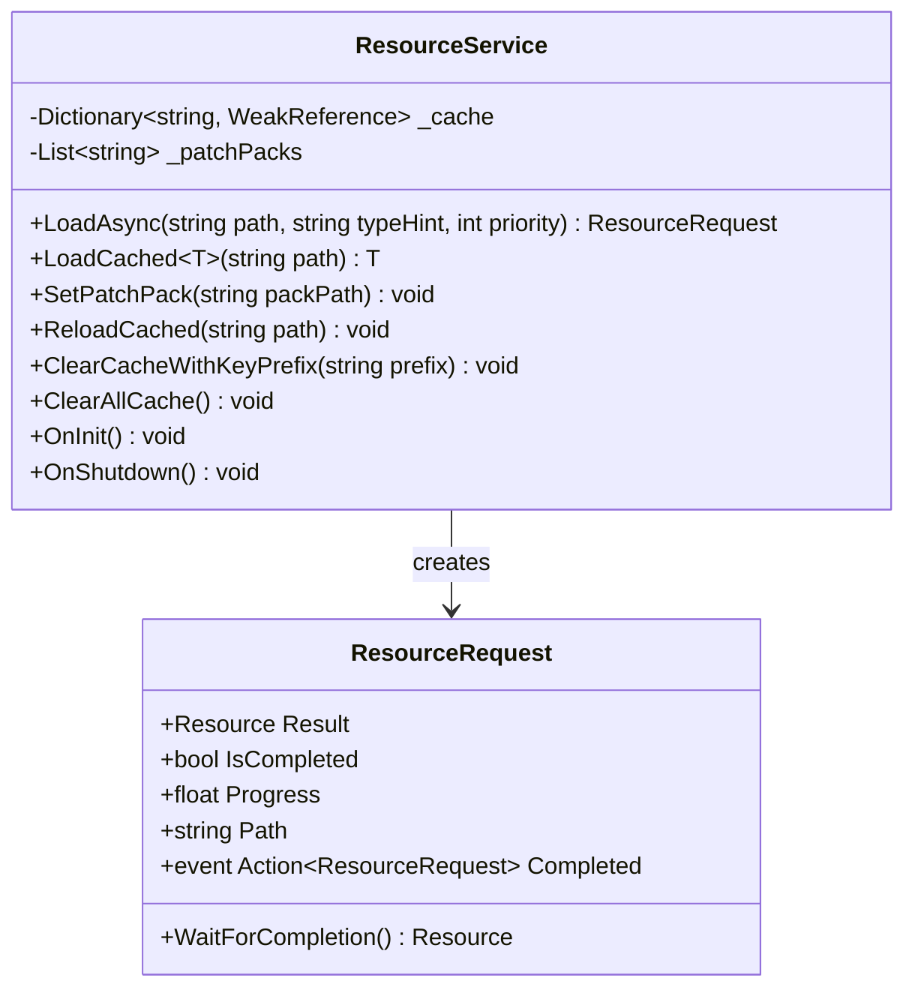
```mermaid
classDiagram
    class ResourceRequest {
        +Resource Result
        +bool IsCompleted
        +float Progress
        +string Path
        +event Action~ResourceRequest~ Completed
        +WaitForCompletion() Resource
    }

    class ResourceService {
        -Dictionary~string, WeakReference~ _cache
        -List~string~ _patchPacks
        +LoadAsync(string path, string typeHint, int priority) ResourceRequest
        +LoadCached~T~(string path) T
        +SetPatchPack(string packPath) void
        +ReloadCached(string path) void
        +ClearCacheWithKeyPrefix(string prefix) void
        +ClearAllCache() void
        +OnInit() void
        +OnShutdown() void
    }

    ResourceService --> ResourceRequest : creates
```

**类定义**：

```csharp
// LynxFramework/Resource/ResourceRequest.cs
public class ResourceRequest
{
    public string Path { get; }
    public Resource Result { get; private set; }
    public bool IsCompleted { get; private set; }
    public float Progress { get; private set; }

    public event Action<ResourceRequest> Completed;

    internal ResourceRequest(string path)
    {
        Path = path;
    }

    internal void SetProgress(float progress) => Progress = progress;
    internal void SetResult(Resource result)
    {
        Result = result;
        IsCompleted = true;
        Completed?.Invoke(this);
    }

    public Resource WaitForCompletion() => Result;
}

// LynxFramework/Resource/ResourceService.cs
public class ResourceService : IModule
{
    private readonly Dictionary<string, WeakReference<Resource>> _cache = new();
    private readonly List<string> _patchPacks = new();

    public int Priority => 20;
    public void OnInit() { }
    public void OnShutdown() => ClearAllCache();

    public ResourceRequest LoadAsync(string path, string typeHint = null, int priority = 0)
    {
        var request = new ResourceRequest(path);

        // 检查缓存
        if (TryGetCached(path, out var cached))
        {
            request.SetResult(cached);
            return request;
        }

        // 使用 Godot ResourceLoader 异步加载
        var args = new Godot.Collections.Dictionary
        {
            ["type_hint"] = typeHint ?? "",
            ["cache_mode"] = (int)ResourceLoader.CacheMode.Reuse
        };

        var error = ResourceLoader.LoadThreadedRequest(path, typeHint);
        if (error != Error.Ok)
        {
            request.SetResult(null);
            return request;
        }

        // 轮询加载状态（通过 UpdateDriver 注册轮询回调）
        PollLoadRequest(request);
        return request;
    }

    public T LoadCached<T>(string path) where T : Resource
    {
        if (TryGetCached(path, out var cached) && cached is T t)
            return t;

        var resource = ResourceLoader.Load<T>(path);
        if (resource != null)
            _cache[path] = new WeakReference<Resource>(resource);
        return resource;
    }

    public void SetPatchPack(string packPath)
    {
        if (ProjectSettings.LoadResourcePack(packPath))
        {
            _patchPacks.Add(packPath);
        }
    }

    public void ReloadCached(string path)
    {
        _cache.Remove(path);
        ResourceLoader.LoadThreadedRequest(path);
    }

    public void ClearCacheWithKeyPrefix(string prefix)
    {
        var keysToRemove = new List<string>();
        foreach (var key in _cache.Keys)
        {
            if (key.StartsWith(prefix))
                keysToRemove.Add(key);
        }
        foreach (var key in keysToRemove)
            _cache.Remove(key);
    }

    public void ClearAllCache() => _cache.Clear();

    private bool TryGetCached(string path, out Resource resource)
    {
        resource = null;
        if (!_cache.TryGetValue(path, out var weakRef)) return false;
        if (!weakRef.TryGetTarget(out resource))
        {
            _cache.Remove(path);
            return false;
        }
        return true;
    }

    // 注意：Godot 4.x C# 中 LoadThreadedGetStatus 不使用 out 参数。
    // 使用 UpdateDriver 注册轮询回调替代 async/await，避免跨帧状态丢失。
    private void PollLoadRequest(ResourceRequest request)
    {
        var progressArray = new Godot.Collections.Array();
        UpdateEntry entry = null;
        entry = _updateDriver.Register(UpdatePhase.Process, 999, (delta) =>
        {
            var status = ResourceLoader.LoadThreadedGetStatus(request.Path, progressArray);
            switch (status)
            {
                case ResourceLoader.ThreadLoadStatus.InProgress:
                    request.SetProgress(progressArray.Count > 0 ? (float)progressArray[0] : 0f);
                    break;
                case ResourceLoader.ThreadLoadStatus.Loaded:
                    var res = ResourceLoader.LoadThreadedGet(request.Path);
                    _cache[request.Path] = new WeakReference<Godot.Resource>(res);
                    request.SetResult(res);
                    _updateDriver.Unregister(entry);
                    break;
                default:
                    request.SetResult(null);
                    _updateDriver.Unregister(entry);
                    break;
            }
        });
    }
}
```

**设计要点**：
- 弱引用缓存防止资源卸载泄漏，同时允许引擎在内存紧张时自动回收
- 异步加载通过 `ResourceLoader.LoadThreadedRequest/GetStatus` 实现，轮询通知进度
- `SetPatchPack` 调用 `ProjectSettings.LoadResourcePack` 实现 .pck 热更资源覆盖
- `ReloadCached` 强制重新加载，用于热更后刷新

---

## 4. 服务层

### 4.1 LogService

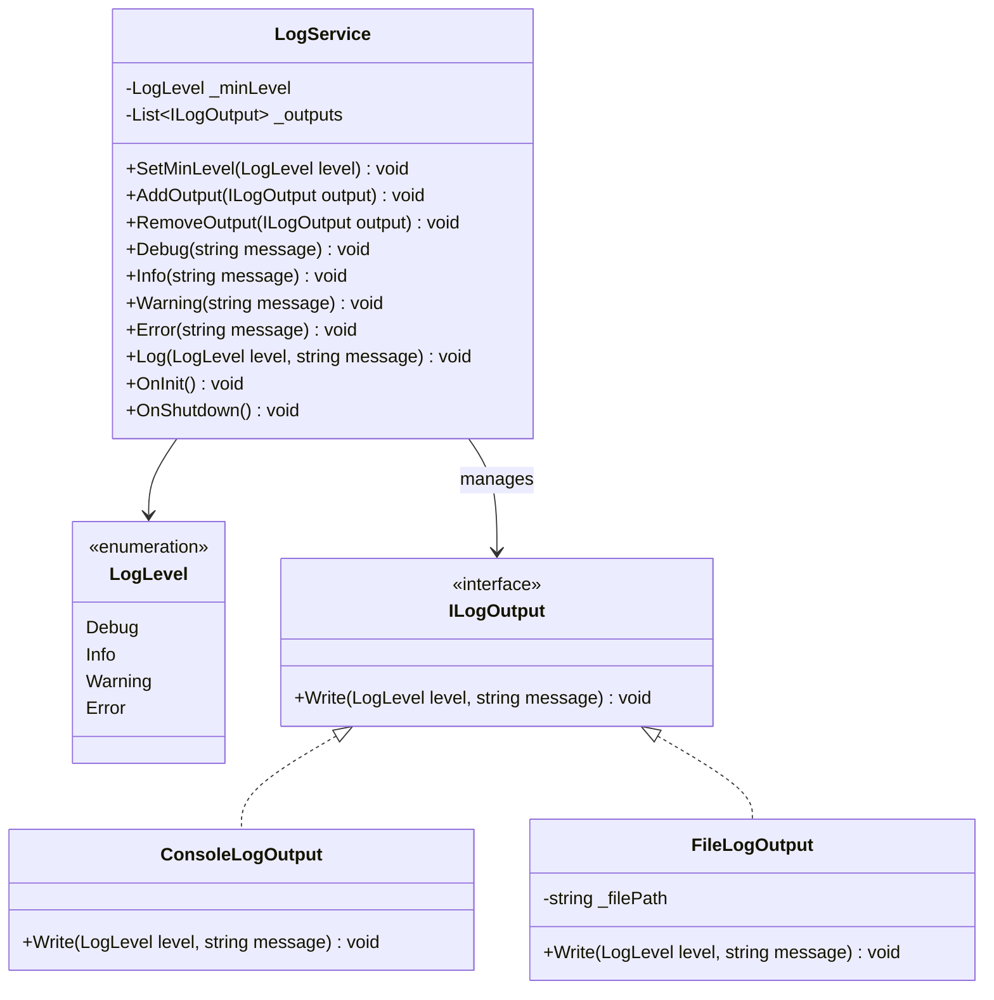
```mermaid
classDiagram
    class LogLevel {
        <<enumeration>>
        Debug
        Info
        Warning
        Error
    }

    class ILogOutput {
        <<interface>>
        +Write(LogLevel level, string message) void
    }

    class ConsoleLogOutput {
        +Write(LogLevel level, string message) void
    }

    class FileLogOutput {
        -string _filePath
        +Write(LogLevel level, string message) void
    }

    class LogService {
        -LogLevel _minLevel
        -List~ILogOutput~ _outputs
        +SetMinLevel(LogLevel level) void
        +AddOutput(ILogOutput output) void
        +RemoveOutput(ILogOutput output) void
        +Debug(string message) void
        +Info(string message) void
        +Warning(string message) void
        +Error(string message) void
        +Log(LogLevel level, string message) void
        +OnInit() void
        +OnShutdown() void
    }

    LogService --> LogLevel
    LogService --> ILogOutput : manages
    ILogOutput <|.. ConsoleLogOutput
    ILogOutput <|.. FileLogOutput
```

**类定义**：

```csharp
// LynxFramework/Log/LogLevel.cs
public enum LogLevel
{
    Debug,
    Info,
    Warning,
    Error
}

// LynxFramework/Log/ILogOutput.cs
public interface ILogOutput
{
    void Write(LogLevel level, string message);
}

// LynxFramework/Log/LogService.cs
public class LogService : IModule
{
    private LogLevel _minLevel = LogLevel.Debug;
    private readonly List<ILogOutput> _outputs = new();

    public int Priority => 10;

    public void OnInit()
    {
        _outputs.Add(new ConsoleLogOutput());
    }

    public void OnShutdown()
    {
        foreach (var output in _outputs)
            (output as IDisposable)?.Dispose();
        _outputs.Clear();
    }

    public void SetMinLevel(LogLevel level) => _minLevel = level;
    public void AddOutput(ILogOutput output) => _outputs.Add(output);
    public void RemoveOutput(ILogOutput output) => _outputs.Remove(output);

    public void Debug(string message) => Log(LogLevel.Debug, message);
    public void Info(string message) => Log(LogLevel.Info, message);
    public void Warning(string message) => Log(LogLevel.Warning, message);
    public void Error(string message) => Log(LogLevel.Error, message);

    public void Log(LogLevel level, string message)
    {
        if (level < _minLevel) return;
        var timestamp = DateTime.Now.ToString("HH:mm:ss.fff");
        var formatted = $"[{timestamp}][{level}] {message}";
        foreach (var output in _outputs)
            output.Write(level, formatted);
    }
}
```

### 4.2 GameSettingsModule

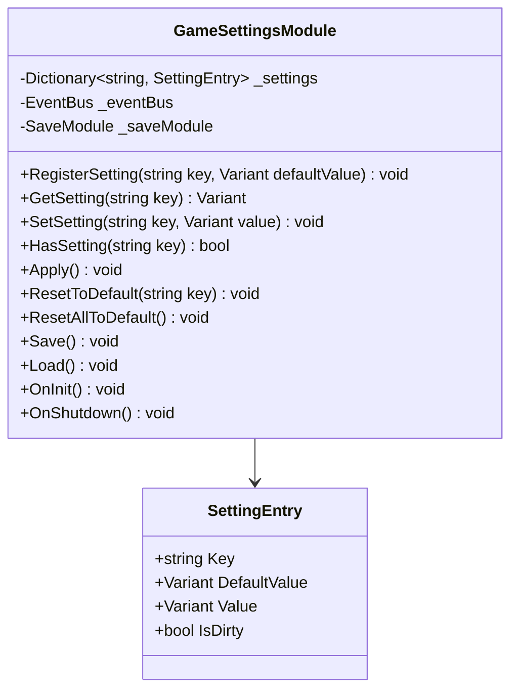
```mermaid
classDiagram
    class SettingEntry {
        +string Key
        +Variant DefaultValue
        +Variant Value
        +bool IsDirty
    }

    class GameSettingsModule {
        -Dictionary~string, SettingEntry~ _settings
        -EventBus _eventBus
        -SaveModule _saveModule
        +RegisterSetting(string key, Variant defaultValue) void
        +GetSetting(string key) Variant
        +SetSetting(string key, Variant value) void
        +HasSetting(string key) bool
        +Apply() void
        +ResetToDefault(string key) void
        +ResetAllToDefault() void
        +Save() void
        +Load() void
        +OnInit() void
        +OnShutdown() void
    }

    GameSettingsModule --> SettingEntry
```

**类定义**：

```csharp
// LynxFramework/Settings/GameSettingsModule.cs
public class GameSettingsModule : IModule
{
    private readonly Dictionary<string, SettingEntry> _settings = new();
    private EventBus _eventBus;
    private SaveModule _saveModule;

    public int Priority => 50;

    public void OnInit()
    {
        // 延迟获取依赖模块
        _eventBus = FrameworkEntry.Instance.GetModule<EventBus>();
        _saveModule = FrameworkEntry.Instance.GetModule<SaveModule>();
        Load();
    }

    public void OnShutdown() => Save();

    public void RegisterSetting(string key, Variant defaultValue)
    {
        if (!_settings.ContainsKey(key))
            _settings[key] = new SettingEntry { Key = key, DefaultValue = defaultValue, Value = defaultValue };
    }

    public Variant GetSetting(string key)
        => _settings.TryGetValue(key, out var entry) ? entry.Value : default;

    public void SetSetting(string key, Variant value)
    {
        if (!_settings.TryGetValue(key, out var entry)) return;
        entry.Value = value;
        entry.IsDirty = true;
        _eventBus?.Emit("settings_changed", new SettingsChangedEventArg { Key = key, Value = value });
    }

    public bool HasSetting(string key) => _settings.ContainsKey(key);

    public void Apply()
    {
        // 应用分辨率
        if (_settings.TryGetValue("resolution", out var res))
            DisplayServer.WindowSetSize(res.Value.AsVector2I());

        // 应用音频总线音量
        if (_settings.TryGetValue("master_volume", out var vol))
            AudioServer.SetBusVolumeDb(0, vol.Value.AsFloat());

        // 键位映射由 InputModule 监听 settings_changed 处理
    }

    public void ResetToDefault(string key)
    {
        if (_settings.TryGetValue(key, out var entry))
        {
            entry.Value = entry.DefaultValue;
            entry.IsDirty = true;
        }
    }

    public void ResetAllToDefault()
    {
        foreach (var entry in _settings.Values)
        {
            entry.Value = entry.DefaultValue;
            entry.IsDirty = true;
        }
    }

    public void Save()
    {
        var data = new Godot.Collections.Dictionary();
        foreach (var kv in _settings)
            data[kv.Key] = kv.Value.Value;
        _saveModule?.Save("settings", 0, data);
    }

    public void Load()
    {
        var data = _saveModule?.Load("settings", 0);
        if (data == null) return;
        foreach (var kv in data)
        {
            if (_settings.TryGetValue(kv.Key.AsString(), out var entry))
                entry.Value = kv.Value;
        }
    }
}

public partial class SettingsChangedEventArg : EventArg
{
    public string Key { get; set; }
    public Variant Value { get; set; }
}
```

### 4.3 DataTableModule

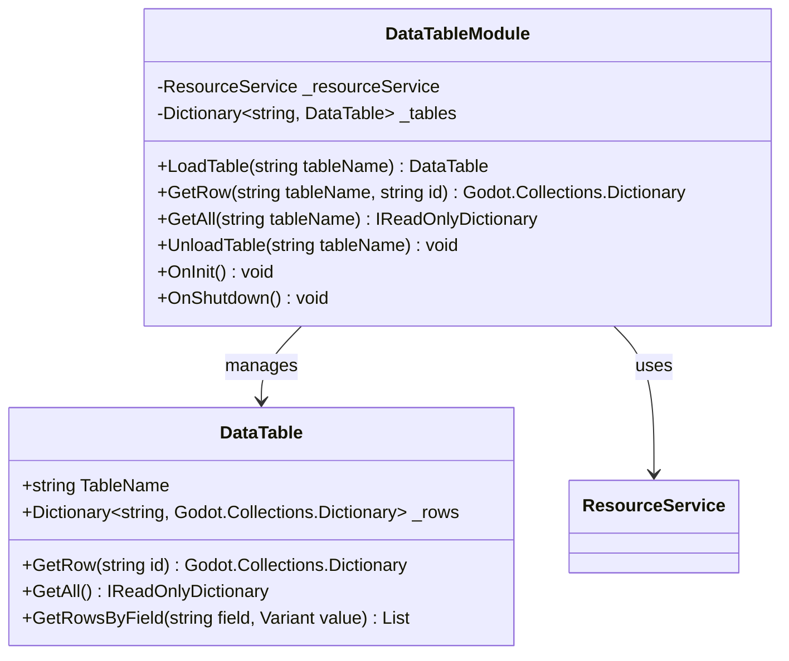
```mermaid
classDiagram
    class DataTable {
        +string TableName
        +Dictionary~string, Godot.Collections.Dictionary~ _rows
        +GetRow(string id) Godot.Collections.Dictionary
        +GetAll() IReadOnlyDictionary
        +GetRowsByField(string field, Variant value) List
    }

    class DataTableModule {
        -ResourceService _resourceService
        -Dictionary~string, DataTable~ _tables
        +LoadTable(string tableName) DataTable
        +GetRow(string tableName, string id) Godot.Collections.Dictionary
        +GetAll(string tableName) IReadOnlyDictionary
        +UnloadTable(string tableName) void
        +OnInit() void
        +OnShutdown() void
    }

    DataTableModule --> DataTable : manages
    DataTableModule --> ResourceService : uses
```

**类定义**：

```csharp
// LynxFramework/Data/DataTable.cs
public class DataTable
{
    public string TableName { get; }
    private readonly Dictionary<string, Godot.Collections.Dictionary> _rows = new();

    public DataTable(string name) => TableName = name;

    public void AddRow(string id, Godot.Collections.Dictionary row) => _rows[id] = row;

    public Godot.Collections.Dictionary GetRow(string id)
        => _rows.TryGetValue(id, out var row) ? row : null;

    public IReadOnlyDictionary<string, Godot.Collections.Dictionary> GetAll() => _rows;

    public List<Godot.Collections.Dictionary> GetRowsByField(string field, Variant value)
    {
        var result = new List<Godot.Collections.Dictionary>();
        foreach (var row in _rows.Values)
        {
            if (row.TryGetValue(field, out var v) && v == value)
                result.Add(row);
        }
        return result;
    }
}

// LynxFramework/Data/DataTableModule.cs
public class DataTableModule : IModule
{
    private ResourceService _resourceService;
    private readonly Dictionary<string, DataTable> _tables = new();

    public int Priority => 60;

    public void OnInit() => _resourceService = FrameworkEntry.Instance.GetModule<ResourceService>();

    public void OnShutdown() => _tables.Clear();

    public DataTable LoadTable(string tableName)
    {
        if (_tables.TryGetValue(tableName, out var existing)) return existing;

        var path = $"res://data/tables/{tableName}.tres";
        var resource = _resourceService.LoadCached<Json>(path);
        if (resource == null) return null;

        var table = new DataTable(tableName);
        var data = Json.ParseString(resource.Data.AsString());
        // 解析 JSON 数组为行字典
        if (data.VariantType == Variant.Type.Array)
        {
            var arr = data.AsGodotArrayOfDictionaries();
            foreach (var row in arr)
            {
                var id = row.ContainsKey("id") ? row["id"].AsString() : Guid.NewGuid().ToString();
                table.AddRow(id, row);
            }
        }
        _tables[tableName] = table;
        return table;
    }

    public Godot.Collections.Dictionary GetRow(string tableName, string id)
        => _tables.TryGetValue(tableName, out var table) ? table.GetRow(id) : null;

    public IReadOnlyDictionary<string, Godot.Collections.Dictionary> GetAll(string tableName)
        => _tables.TryGetValue(tableName, out var table) ? table.GetAll() : null;

    public void UnloadTable(string tableName) => _tables.Remove(tableName);
}
```

### 4.4 LocalizationModule

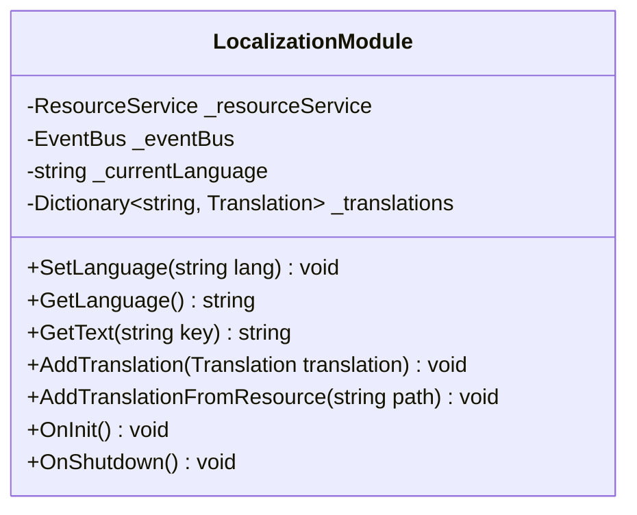
```mermaid
classDiagram
    class LocalizationModule {
        -ResourceService _resourceService
        -EventBus _eventBus
        -string _currentLanguage
        -Dictionary~string, Translation~ _translations
        +SetLanguage(string lang) void
        +GetLanguage() string
        +GetText(string key) string
        +AddTranslation(Translation translation) void
        +AddTranslationFromResource(string path) void
        +OnInit() void
        +OnShutdown() void
    }
```

**类定义**：

```csharp
// LynxFramework/Localization/LocalizationModule.cs
public class LocalizationModule : IModule
{
    private ResourceService _resourceService;
    private EventBus _eventBus;
    private string _currentLanguage = "en";
    private readonly Dictionary<string, Translation> _translations = new();

    public int Priority => 70;

    public void OnInit()
    {
        _resourceService = FrameworkEntry.Instance.GetModule<ResourceService>();
        _eventBus = FrameworkEntry.Instance.GetModule<EventBus>();
    }

    public void OnShutdown() => _translations.Clear();

    public void SetLanguage(string lang)
    {
        if (_currentLanguage == lang) return;
        _currentLanguage = lang;
        TranslationServer.SetLocale(lang);
        _eventBus?.Emit("language_changed", new LanguageChangedEventArg { Language = lang });
    }

    public string GetLanguage() => _currentLanguage;

    public string GetText(string key) => TranslationServer.Translate(key);

    public void AddTranslation(Translation translation)
    {
        _translations[translation.Locale] = translation;
        TranslationServer.AddTranslation(translation);
    }

    public void AddTranslationFromResource(string path)
    {
        var translation = _resourceService.LoadCached<Translation>(path);
        if (translation != null)
            AddTranslation(translation);
    }
}

public partial class LanguageChangedEventArg : EventArg
{
    public string Language { get; set; }
}
```

---

## 5. 场景与世界

### 5.1 SceneModule

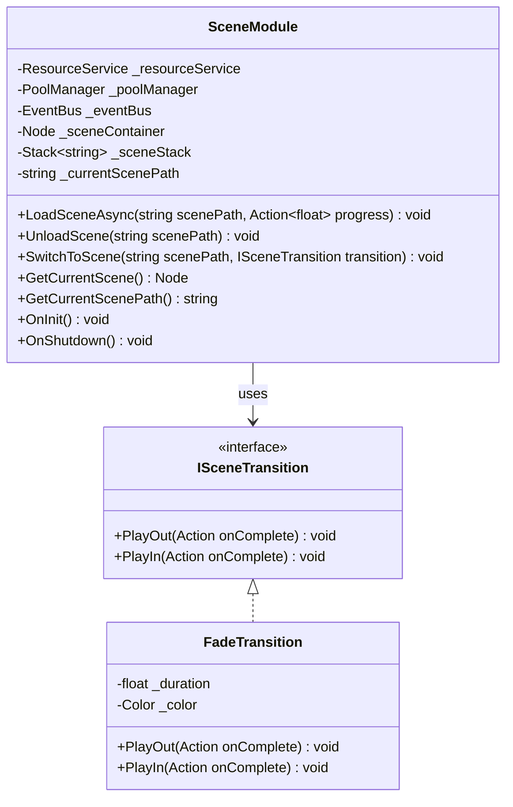
```mermaid
classDiagram
    class ISceneTransition {
        <<interface>>
        +PlayOut(Action onComplete) void
        +PlayIn(Action onComplete) void
    }

    class FadeTransition {
        -float _duration
        -Color _color
        +PlayOut(Action onComplete) void
        +PlayIn(Action onComplete) void
    }

    class SceneModule {
        -ResourceService _resourceService
        -PoolManager _poolManager
        -EventBus _eventBus
        -Node _sceneContainer
        -Stack~string~ _sceneStack
        -string _currentScenePath
        +LoadSceneAsync(string scenePath, Action~float~ progress) void
        +UnloadScene(string scenePath) void
        +SwitchToScene(string scenePath, ISceneTransition transition) void
        +GetCurrentScene() Node
        +GetCurrentScenePath() string
        +OnInit() void
        +OnShutdown() void
    }

    SceneModule --> ISceneTransition : uses
    ISceneTransition <|.. FadeTransition
```

**类定义**：

```csharp
// LynxFramework/Scene/ISceneTransition.cs
public interface ISceneTransition
{
    void PlayOut(Action onComplete);
    void PlayIn(Action onComplete);
}

// LynxFramework/Scene/SceneModule.cs
public class SceneModule : IModule
{
    private ResourceService _resourceService;
    private PoolManager _poolManager;
    private EventBus _eventBus;
    private Node _sceneContainer;
    private readonly Stack<string> _sceneStack = new();
    private string _currentScenePath;

    public int Priority => 120;

    public void OnInit()
    {
        _resourceService = FrameworkEntry.Instance.GetModule<ResourceService>();
        _poolManager = FrameworkEntry.Instance.GetModule<PoolManager>();
        _eventBus = FrameworkEntry.Instance.GetModule<EventBus>();
        _sceneContainer = new Node { Name = "SceneContainer" };
        FrameworkEntry.Instance.AddChild(_sceneContainer);
    }

    public void OnShutdown()
    {
        foreach (var child in _sceneContainer.GetChildren())
            child.QueueFree();
        _sceneContainer.QueueFree();
    }

    public async void LoadSceneAsync(string scenePath, Action<float> progress = null)
    {
        var request = _resourceService.LoadAsync(scenePath);
        request.Completed += r => progress?.Invoke(1f);

        // 轮询进度
        while (!request.IsCompleted)
        {
            progress?.Invoke(request.Progress);
            await FrameworkEntry.Instance.ToSignal(
                Engine.GetMainLoop(), SceneTree.SignalName.ProcessFrame);
        }

        if (request.Result is PackedScene scene)
        {
            var instance = scene.Instantiate();
            _sceneContainer.AddChild(instance);
            _currentScenePath = scenePath;
            _eventBus?.Emit("scene_loaded", new SceneEventArg { ScenePath = scenePath });
        }
    }

    public void UnloadScene(string scenePath)
    {
        // 查找并释放对应场景节点
        foreach (var child in _sceneContainer.GetChildren())
        {
            if (child.SceneFilePath == scenePath)
            {
                child.QueueFree();
                _eventBus?.Emit("scene_unloaded", new SceneEventArg { ScenePath = scenePath });
                return;
            }
        }
    }

    public async void SwitchToScene(string scenePath, ISceneTransition transition = null)
    {
        // 1. 播放转场出场动画
        if (transition != null)
            await PlayTransitionOut(transition);

        // 2. 卸载当前场景
        if (!string.IsNullOrEmpty(_currentScenePath))
        {
            _sceneStack.Push(_currentScenePath);
            UnloadScene(_currentScenePath);
        }

        // 3. 加载新场景
        LoadSceneAsync(scenePath);

        // 4. 播放转场入场动画
        if (transition != null)
            await PlayTransitionIn(transition);
    }

    public Node GetCurrentScene() => _sceneContainer.GetChildCount() > 0 ? _sceneContainer.GetChild(0) : null;
    public string GetCurrentScenePath() => _currentScenePath;

    private async System.Threading.Tasks.Task PlayTransitionOut(ISceneTransition transition)
    {
        var tcs = new System.Threading.Tasks.TaskCompletionSource<bool>();
        transition.PlayOut(() => tcs.SetResult(true));
        await tcs.Task;
    }

    private async System.Threading.Tasks.Task PlayTransitionIn(ISceneTransition transition)
    {
        var tcs = new System.Threading.Tasks.TaskCompletionSource<bool>();
        transition.PlayIn(() => tcs.SetResult(true));
        await tcs.Task;
    }
}

public partial class SceneEventArg : EventArg
{
    public string ScenePath { get; set; }
}
```

### 5.2 WorldStreamingModule

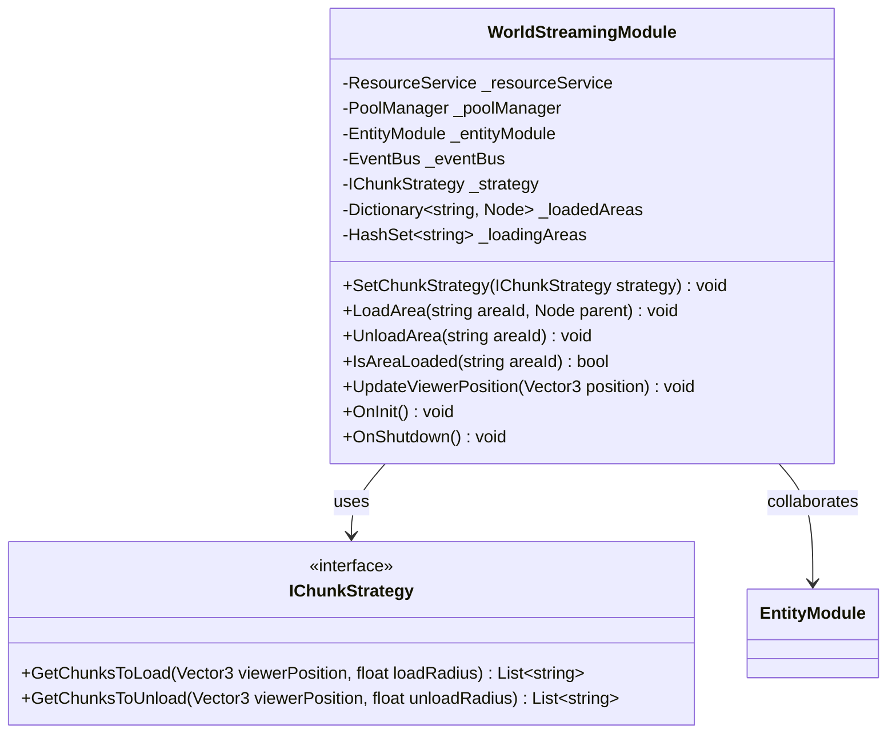
```mermaid
classDiagram
    class IChunkStrategy {
        <<interface>>
        +GetChunksToLoad(Vector3 viewerPosition, float loadRadius) List~string~
        +GetChunksToUnload(Vector3 viewerPosition, float unloadRadius) List~string~
    }

    class WorldStreamingModule {
        -ResourceService _resourceService
        -PoolManager _poolManager
        -EntityModule _entityModule
        -EventBus _eventBus
        -IChunkStrategy _strategy
        -Dictionary~string, Node~ _loadedAreas
        -HashSet~string~ _loadingAreas
        +SetChunkStrategy(IChunkStrategy strategy) void
        +LoadArea(string areaId, Node parent) void
        +UnloadArea(string areaId) void
        +IsAreaLoaded(string areaId) bool
        +UpdateViewerPosition(Vector3 position) void
        +OnInit() void
        +OnShutdown() void
    }

    WorldStreamingModule --> IChunkStrategy : uses
    WorldStreamingModule --> EntityModule : collaborates
```

**类定义**：

```csharp
// LynxFramework/Streaming/IChunkStrategy.cs
public interface IChunkStrategy
{
    List<string> GetChunksToLoad(Vector3 viewerPosition, float loadRadius);
    List<string> GetChunksToUnload(Vector3 viewerPosition, float unloadRadius);
}

// LynxFramework/Streaming/WorldStreamingModule.cs
public class WorldStreamingModule : IModule
{
    private ResourceService _resourceService;
    private PoolManager _poolManager;
    private EntityModule _entityModule;
    private EventBus _eventBus;
    private IChunkStrategy _strategy;
    private readonly Dictionary<string, Node> _loadedAreas = new();
    private readonly HashSet<string> _loadingAreas = new();

    public int Priority => 160;

    public void OnInit()
    {
        _resourceService = FrameworkEntry.Instance.GetModule<ResourceService>();
        _poolManager = FrameworkEntry.Instance.GetModule<PoolManager>();
        _entityModule = FrameworkEntry.Instance.GetModule<EntityModule>();
        _eventBus = FrameworkEntry.Instance.GetModule<EventBus>();
    }

    public void OnShutdown()
    {
        foreach (var area in _loadedAreas.Values)
            area.QueueFree();
        _loadedAreas.Clear();
    }

    public void SetChunkStrategy(IChunkStrategy strategy) => _strategy = strategy;

    public async void LoadArea(string areaId, Node parent)
    {
        if (_loadedAreas.ContainsKey(areaId) || _loadingAreas.Contains(areaId)) return;
        _loadingAreas.Add(areaId);

        var scenePath = $"res://world/areas/{areaId}.tscn";
        var request = _resourceService.LoadAsync(scenePath);
        while (!request.IsCompleted)
            await FrameworkEntry.Instance.ToSignal(
                Engine.GetMainLoop(), SceneTree.SignalName.ProcessFrame);

        if (request.Result is PackedScene scene)
        {
            var instance = scene.Instantiate();
            parent?.AddChild(instance);
            _loadedAreas[areaId] = instance;
        }
        _loadingAreas.Remove(areaId);
    }

    public void UnloadArea(string areaId)
    {
        if (!_loadedAreas.TryGetValue(areaId, out var node)) return;
        // 回收区块内动态实体
        _entityModule?.RecycleEntitiesInNode(node);
        node.QueueFree();
        _loadedAreas.Remove(areaId);
    }

    public bool IsAreaLoaded(string areaId) => _loadedAreas.ContainsKey(areaId);

    public void UpdateViewerPosition(Vector3 position)
    {
        if (_strategy == null) return;
        // 加载需要显示的区块
        var toLoad = _strategy.GetChunksToLoad(position, 100f);
        foreach (var chunkId in toLoad)
            LoadArea(chunkId, FrameworkEntry.Instance);

        // 卸载远离的区块
        var toUnload = _strategy.GetChunksToUnload(position, 150f);
        foreach (var chunkId in toUnload)
            UnloadArea(chunkId);
    }
}
```

---

## 6. UI 系统

### 6.1 UIModule

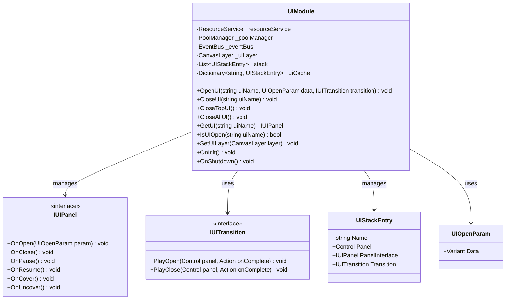
```mermaid
classDiagram
    class IUIPanel {
        <<interface>>
        +OnOpen(UIOpenParam param) void
        +OnClose() void
        +OnPause() void
        +OnResume() void
        +OnCover() void
        +OnUncover() void
    }

    class IUITransition {
        <<interface>>
        +PlayOpen(Control panel, Action onComplete) void
        +PlayClose(Control panel, Action onComplete) void
    }

    class UIOpenParam {
        +Variant Data
    }

    class UIStackEntry {
        +string Name
        +Control Panel
        +IUIPanel PanelInterface
        +IUITransition Transition
    }

    class UIModule {
        -ResourceService _resourceService
        -PoolManager _poolManager
        -EventBus _eventBus
        -CanvasLayer _uiLayer
        -List~UIStackEntry~ _stack
        -Dictionary~string, UIStackEntry~ _uiCache
        +OpenUI(string uiName, UIOpenParam data, IUITransition transition) void
        +CloseUI(string uiName) void
        +CloseTopUI() void
        +CloseAllUI() void
        +GetUI(string uiName) IUIPanel
        +IsUIOpen(string uiName) bool
        +SetUILayer(CanvasLayer layer) void
        +OnInit() void
        +OnShutdown() void
    }

    UIModule --> IUIPanel : manages
    UIModule --> IUITransition : uses
    UIModule --> UIStackEntry : manages
    UIModule --> UIOpenParam : uses
```

**类定义**：

```csharp
// LynxFramework/UI/IUIPanel.cs
public interface IUIPanel
{
    void OnOpen(UIOpenParam param);
    void OnClose();
    void OnPause();   // 被新面板覆盖时调用
    void OnResume();  // 上层面板关闭，恢复顶层时调用
    void OnCover();   // 有新面板打开覆盖
    void OnUncover(); // 上层面板关闭露出
}

// LynxFramework/UI/IUITransition.cs
public interface IUITransition
{
    void PlayOpen(Control panel, Action onComplete);
    void PlayClose(Control panel, Action onComplete);
}

// LynxFramework/UI/UIOpenParam.cs
public class UIOpenParam
{
    public Variant Data { get; set; }
    public static UIOpenParam Empty { get; } = new() { Data = default };
}

// LynxFramework/UI/UIModule.cs
public class UIModule : IModule
{
    private ResourceService _resourceService;
    private PoolManager _poolManager;
    private EventBus _eventBus;
    private CanvasLayer _uiLayer;
    private readonly List<UIStackEntry> _stack = new();

    public int Priority => 130;

    public void OnInit()
    {
        _resourceService = FrameworkEntry.Instance.GetModule<ResourceService>();
        _poolManager = FrameworkEntry.Instance.GetModule<PoolManager>();
        _eventBus = FrameworkEntry.Instance.GetModule<EventBus>();

        _uiLayer = new CanvasLayer { Name = "UILayer", Layer = 100 };
        FrameworkEntry.Instance.AddChild(_uiLayer);
    }

    public void OnShutdown() => CloseAllUI();

    public void SetUILayer(CanvasLayer layer) => _uiLayer = layer;

    public void OpenUI(string uiName, UIOpenParam data = null, IUITransition transition = null)
    {
        data ??= UIOpenParam.Empty;

        // 如果已在栈中，将其移到顶部
        var existingIndex = _stack.FindIndex(e => e.Name == uiName);
        if (existingIndex >= 0)
        {
            var existing = _stack[existingIndex];
            _stack.RemoveAt(existingIndex);
            _stack.Add(existing);
            existing.PanelInterface.OnResume();
            return;
        }

        // 实例化 UI 面板
        var scenePath = $"res://ui/{uiName}.tscn";
        var scene = _resourceService.LoadCached<PackedScene>(scenePath);
        if (scene == null) return;

        var instance = scene.Instantiate<Control>();
        _uiLayer.AddChild(instance);

        var entry = new UIStackEntry
        {
            Name = uiName,
            Panel = instance,
            PanelInterface = instance as IUIPanel,
            Transition = transition
        };

        // 通知当前栈顶面板被覆盖
        if (_stack.Count > 0)
        {
            var top = _stack[^1];
            top.PanelInterface?.OnCover();
        }

        _stack.Add(entry);

        // 拦截底层 UI 输入
        for (int i = 0; i < _stack.Count - 1; i++)
            _stack[i].Panel.MouseFilter = Control.MouseFilterEnum.Ignore;

        // 播放过渡动画
        if (transition != null)
            transition.PlayOpen(instance, () => { });
        else
            instance.Visible = true;

        entry.PanelInterface?.OnOpen(data);
        _eventBus?.Emit("ui_opened", new UIEventArg { UIName = uiName });
    }

    public void CloseUI(string uiName)
    {
        var index = _stack.FindIndex(e => e.Name == uiName);
        if (index < 0) return;

        var entry = _stack[index];
        entry.PanelInterface?.OnClose();

        if (entry.Transition != null)
        {
            entry.Transition.PlayClose(entry.Panel, () => RemoveEntry(entry, index));
        }
        else
        {
            RemoveEntry(entry, index);
        }

        // 通知新的栈顶面板恢复
        if (_stack.Count > 0)
            _stack[^1].PanelInterface?.OnResume();

        _eventBus?.Emit("ui_closed", new UIEventArg { UIName = uiName });
    }

    public void CloseTopUI()
    {
        if (_stack.Count > 0)
            CloseUI(_stack[^1].Name);
    }

    public void CloseAllUI()
    {
        while (_stack.Count > 0)
            CloseUI(_stack[^1].Name);
    }

    public IUIPanel GetUI(string uiName)
    {
        var entry = _stack.Find(e => e.Name == uiName);
        return entry?.PanelInterface;
    }

    public bool IsUIOpen(string uiName) => _stack.Exists(e => e.Name == uiName);

    private void RemoveEntry(UIStackEntry entry, int index)
    {
        _stack.RemoveAt(index);
        entry.Panel.QueueFree();
    }
}

public sealed class UIStackEntry
{
    public string Name;
    public Control Panel;
    public IUIPanel PanelInterface;
    public IUITransition Transition;
}

public partial class UIEventArg : EventArg
{
    public string UIName { get; set; }
}
```

---

## 7. 音频与输入

### 7.1 AudioModule

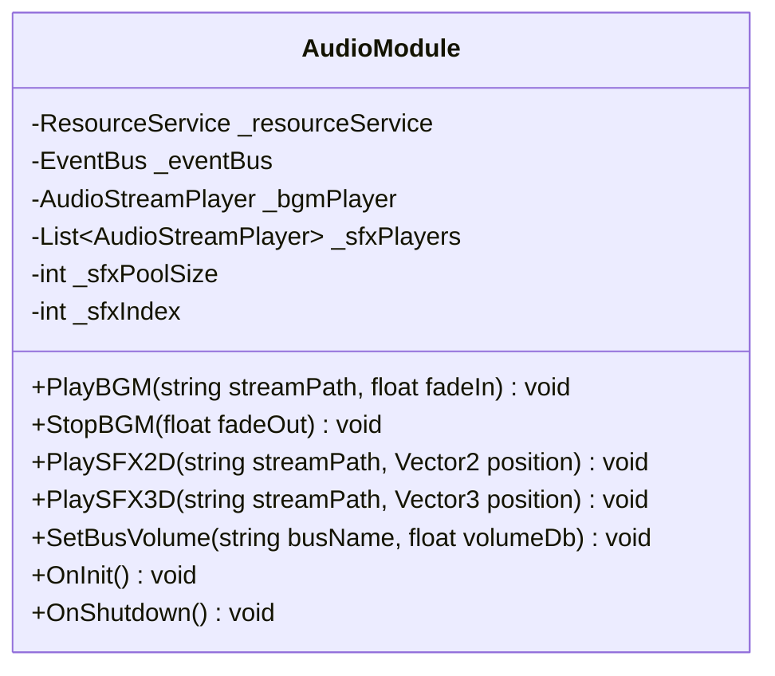
```mermaid
classDiagram
    class AudioModule {
        -ResourceService _resourceService
        -EventBus _eventBus
        -AudioStreamPlayer _bgmPlayer
        -List~AudioStreamPlayer~ _sfxPlayers
        -int _sfxPoolSize
        -int _sfxIndex
        +PlayBGM(string streamPath, float fadeIn) void
        +StopBGM(float fadeOut) void
        +PlaySFX2D(string streamPath, Vector2 position) void
        +PlaySFX3D(string streamPath, Vector3 position) void
        +SetBusVolume(string busName, float volumeDb) void
        +OnInit() void
        +OnShutdown() void
    }
```

**类定义**：

```csharp
// LynxFramework/Audio/AudioModule.cs
public class AudioModule : IModule
{
    private ResourceService _resourceService;
    private EventBus _eventBus;
    private AudioStreamPlayer _bgmPlayer;
    private readonly List<AudioStreamPlayer> _sfxPlayers = new();
    private int _sfxPoolSize = 8;
    private int _sfxIndex;

    public int Priority => 100;

    public void OnInit()
    {
        _resourceService = FrameworkEntry.Instance.GetModule<ResourceService>();
        _eventBus = FrameworkEntry.Instance.GetModule<EventBus>();

        _bgmPlayer = new AudioStreamPlayer { Name = "BGMPlayer" };
        FrameworkEntry.Instance.AddChild(_bgmPlayer);

        for (int i = 0; i < _sfxPoolSize; i++)
        {
            var player = new AudioStreamPlayer { Name = $"SFXPlayer_{i}" };
            FrameworkEntry.Instance.AddChild(player);
            _sfxPlayers.Add(player);
        }
    }

    public void OnShutdown()
    {
        _bgmPlayer?.QueueFree();
        foreach (var p in _sfxPlayers) p.QueueFree();
        _sfxPlayers.Clear();
    }

    public void PlayBGM(string streamPath, float fadeIn = 0f)
    {
        var stream = _resourceService.LoadCached<AudioStream>(streamPath);
        if (stream == null) return;

        if (fadeIn > 0)
        {
            _bgmPlayer.VolumeDb = -80f;
            var tween = _bgmPlayer.CreateTween();
            tween.TweenProperty(_bgmPlayer, "volume_db", 0f, fadeIn);
        }

        _bgmPlayer.Stream = stream;
        _bgmPlayer.Play();
    }

    public void StopBGM(float fadeOut = 0f)
    {
        if (fadeOut > 0)
        {
            var tween = _bgmPlayer.CreateTween();
            tween.TweenProperty(_bgmPlayer, "volume_db", -80f, fadeOut);
            tween.TweenCallback(Callable.From(() => _bgmPlayer.Stop()));
        }
        else
        {
            _bgmPlayer.Stop();
        }
    }

    public void PlaySFX2D(string streamPath, Vector2 position)
    {
        var stream = _resourceService.LoadCached<AudioStream>(streamPath);
        if (stream == null) return;

        var player2D = new AudioStreamPlayer2D { Position = position, Stream = stream };
        FrameworkEntry.Instance.AddChild(player2D);
        player2D.Play();
        player2D.Finished += () => player2D.QueueFree();
    }

    public void PlaySFX3D(string streamPath, Vector3 position)
    {
        var stream = _resourceService.LoadCached<AudioStream>(streamPath);
        if (stream == null) return;

        var player3D = new AudioStreamPlayer3D { Position = position, Stream = stream };
        FrameworkEntry.Instance.AddChild(player3D);
        player3D.Play();
        player3D.Finished += () => player3D.QueueFree();
    }

    public void SetBusVolume(string busName, float volumeDb)
    {
        var busIndex = AudioServer.GetBusIndex(busName);
        if (busIndex >= 0)
            AudioServer.SetBusVolumeDb(busIndex, volumeDb);
    }
}
```

### 7.2 InputModule

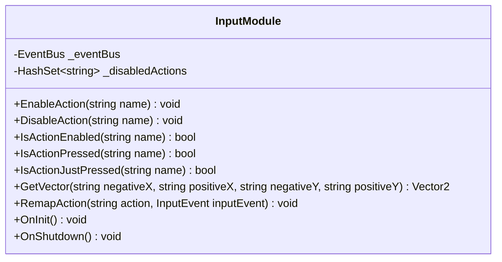
```mermaid
classDiagram
    class InputModule {
        -EventBus _eventBus
        -HashSet~string~ _disabledActions
        +EnableAction(string name) void
        +DisableAction(string name) void
        +IsActionEnabled(string name) bool
        +IsActionPressed(string name) bool
        +IsActionJustPressed(string name) bool
        +GetVector(string negativeX, string positiveX, string negativeY, string positiveY) Vector2
        +RemapAction(string action, InputEvent inputEvent) void
        +OnInit() void
        +OnShutdown() void
    }
```

**类定义**：

```csharp
// LynxFramework/Input/InputModule.cs
public class InputModule : IModule
{
    private EventBus _eventBus;
    private readonly HashSet<string> _disabledActions = new();

    public int Priority => 80;

    public void OnInit()
    {
        _eventBus = FrameworkEntry.Instance.GetModule<EventBus>();
    }

    public void OnShutdown() => _disabledActions.Clear();

    public void EnableAction(string name) => _disabledActions.Remove(name);
    public void DisableAction(string name) => _disabledActions.Add(name);
    public bool IsActionEnabled(string name) => !_disabledActions.Contains(name);

    public bool IsActionPressed(string name)
        => IsActionEnabled(name) && Godot.Input.IsActionPressed(name);

    public bool IsActionJustPressed(string name)
        => IsActionEnabled(name) && Godot.Input.IsActionJustPressed(name);

    public Vector2 GetVector(string negativeX, string positiveX, string negativeY, string positiveY)
    {
        if (_disabledActions.Contains(negativeX) || _disabledActions.Contains(positiveX) ||
            _disabledActions.Contains(negativeY) || _disabledActions.Contains(positiveY))
            return Vector2.Zero;
        return Godot.Input.GetVector(negativeX, positiveX, negativeY, positiveY);
    }

    public void RemapAction(string action, InputEvent inputEvent)
    {
        // 清除旧映射，添加新映射
        var actionEvents = Godot.InputMap.ActionGetEvents(action);
        Godot.InputMap.ActionEraseEvents(action);
        Godot.InputMap.ActionAddEvent(action, inputEvent);

        _eventBus?.Emit("input_remap", new InputRemapEventArg
        {
            Action = action,
            Event = inputEvent
        });
    }
}

public partial class InputRemapEventArg : EventArg
{
    public string Action { get; set; }
    public InputEvent Event { get; set; }
}
```

### 7.3 InputBufferModule

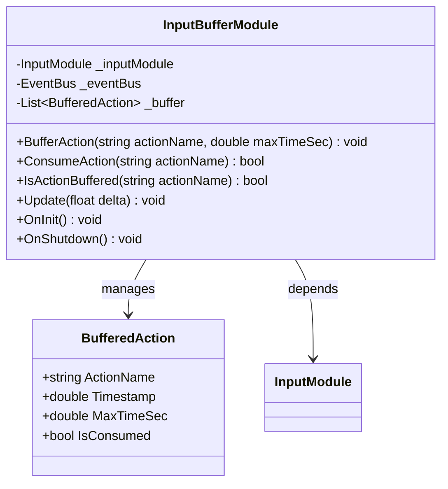
```mermaid
classDiagram
    class BufferedAction {
        +string ActionName
        +double Timestamp
        +double MaxTimeSec
        +bool IsConsumed
    }

    class InputBufferModule {
        -InputModule _inputModule
        -EventBus _eventBus
        -List~BufferedAction~ _buffer
        +BufferAction(string actionName, double maxTimeSec) void
        +ConsumeAction(string actionName) bool
        +IsActionBuffered(string actionName) bool
        +Update(float delta) void
        +OnInit() void
        +OnShutdown() void
    }

    InputBufferModule --> BufferedAction : manages
    InputBufferModule --> InputModule : depends
```

**类定义**：

```csharp
// LynxFramework/Input/InputBufferModule.cs
public class InputBufferModule : IModule
{
    private InputModule _inputModule;
    private EventBus _eventBus;
    private readonly List<BufferedAction> _buffer = new();
    private UpdateEntry _updateEntry;

    public int Priority => 90;

    public void OnInit()
    {
        _inputModule = FrameworkEntry.Instance.GetModule<InputModule>();
        _eventBus = FrameworkEntry.Instance.GetModule<EventBus>();

        var updateDriver = FrameworkEntry.Instance.GetModule<UpdateDriver>();
        _updateEntry = updateDriver.Register(UpdatePhase.Process, 100, Update);
    }

    public void OnShutdown() => _updateEntry?.Callback = null;

    public void BufferAction(string actionName, double maxTimeSec = 0.2)
    {
        _buffer.Add(new BufferedAction
        {
            ActionName = actionName,
            Timestamp = Time.GetTicksMsec() / 1000.0,
            MaxTimeSec = maxTimeSec,
            IsConsumed = false
        });
    }

    public bool ConsumeAction(string actionName)
    {
        var now = Time.GetTicksMsec() / 1000.0;
        for (int i = _buffer.Count - 1; i >= 0; i--)
        {
            var action = _buffer[i];
            if (action.ActionName == actionName && !action.IsConsumed)
            {
                if (now - action.Timestamp <= action.MaxTimeSec)
                {
                    action.IsConsumed = true;
                    return true;
                }
            }
        }
        return false;
    }

    public bool IsActionBuffered(string actionName)
    {
        var now = Time.GetTicksMsec() / 1000.0;
        foreach (var action in _buffer)
        {
            if (action.ActionName == actionName && !action.IsConsumed &&
                now - action.Timestamp <= action.MaxTimeSec)
                return true;
        }
        return false;
    }

    public void Update(float delta)
    {
        var now = Time.GetTicksMsec() / 1000.0;
        _buffer.RemoveAll(a => a.IsConsumed || now - a.Timestamp > a.MaxTimeSec);
    }
}

public struct BufferedAction
{
    public string ActionName;
    public double Timestamp;
    public double MaxTimeSec;
    public bool IsConsumed;
}
```

---

## 8. 网络

### 8.1 NetworkModule

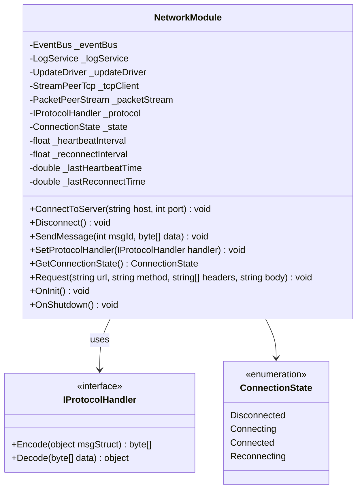
```mermaid
classDiagram
    class ConnectionState {
        <<enumeration>>
        Disconnected
        Connecting
        Connected
        Reconnecting
    }

    class IProtocolHandler {
        <<interface>>
        +Encode(object msgStruct) byte[]
        +Decode(byte[] data) object
    }

    class NetworkModule {
        -EventBus _eventBus
        -LogService _logService
        -UpdateDriver _updateDriver
        -StreamPeerTcp _tcpClient
        -PacketPeerStream _packetStream
        -IProtocolHandler _protocol
        -ConnectionState _state
        -float _heartbeatInterval
        -float _reconnectInterval
        -double _lastHeartbeatTime
        -double _lastReconnectTime
        +ConnectToServer(string host, int port) void
        +Disconnect() void
        +SendMessage(int msgId, byte[] data) void
        +SetProtocolHandler(IProtocolHandler handler) void
        +GetConnectionState() ConnectionState
        +Request(string url, string method, string[] headers, string body) void
        +OnInit() void
        +OnShutdown() void
    }

    NetworkModule --> IProtocolHandler : uses
    NetworkModule --> ConnectionState
```

**类定义**：

```csharp
// LynxFramework/Network/IProtocolHandler.cs
public interface IProtocolHandler
{
    byte[] Encode(object msgStruct);
    object Decode(byte[] data);
}

// LynxFramework/Network/NetworkModule.cs
// 注意：NetworkModule 不继承 GodotObject，因此不使用 [Signal] / EmitSignal。
// 所有事件通过 EventBus 发布。
public partial class NetworkModule : IModule
{
    private EventBus _eventBus;
    private LogService _logService;
    private UpdateDriver _updateDriver;
    private StreamPeerTcp _tcpClient;
    private PacketPeerStream _packetStream;
    private IProtocolHandler _protocol;
    private ConnectionState _state = ConnectionState.Disconnected;
    private float _heartbeatInterval = 30f;
    private float _reconnectInterval = 5f;
    private double _lastHeartbeatTime;
    private double _lastReconnectTime;
    private string _host;
    private int _port;
    private UpdateEntry _updateEntry;

    public int Priority => 110;

    public void OnInit()
    {
        _eventBus = FrameworkEntry.Instance.GetModule<EventBus>();
        _logService = FrameworkEntry.Instance.GetModule<LogService>();
        _updateDriver = FrameworkEntry.Instance.GetModule<UpdateDriver>();
        _updateEntry = _updateDriver.Register(UpdatePhase.Process, 200, OnUpdate);
    }

    public void OnShutdown()
    {
        Disconnect();
        if (_updateEntry != null)
            _updateDriver.Unregister(_updateEntry);
    }

    public void ConnectToServer(string host, int port)
    {
        _host = host;
        _port = port;
        _tcpClient = new StreamPeerTcp();
        _packetStream = new PacketPeerStream { StreamPeer = _tcpClient };

        var err = _tcpClient.ConnectToHost(host, port);
        if (err != Error.Ok)
        {
            _logService?.Error($"TCP connect failed: {err}");
            return;
        }
        SetState(ConnectionState.Connecting);
    }

    public void Disconnect()
    {
        if (_tcpClient != null && _tcpClient.GetStatus() != StreamPeerTcp.Status.None)
            _tcpClient.DisconnectFromHost();
        SetState(ConnectionState.Disconnected);
    }

    public void SendMessage(int msgId, byte[] data)
    {
        if (_state != ConnectionState.Connected) return;

        // 消息头: msgId(4 bytes) + length(4 bytes) + body
        var header = new byte[8];
        BitConverter.GetBytes(msgId).CopyTo(header, 0);
        BitConverter.GetBytes(data.Length).CopyTo(header, 4);

        var packet = new byte[header.Length + data.Length];
        Buffer.BlockCopy(header, 0, packet, 0, header.Length);
        Buffer.BlockCopy(data, 0, packet, header.Length, data.Length);
        _packetStream.PutPacket(packet);
    }

    public void SetProtocolHandler(IProtocolHandler handler) => _protocol = handler;
    public ConnectionState GetConnectionState() => _state;

    public async void Request(string url, string method, string[] headers, string body)
    {
        var httpClient = new HttpRequest();
        FrameworkEntry.Instance.AddChild(httpClient);
        httpClient.RequestCompleted += (result, responseCode, responseHeaders, responseBody) =>
        {
            httpClient.QueueFree();
        };
        httpClient.Request(url, headers,
            (HttpClient.Method)Enum.Parse(typeof(HttpClient.Method), method, true), body);
    }

    private void OnUpdate(float delta)
    {
        if (_state == ConnectionState.Disconnected) return;
        var status = _tcpClient.GetStatus();

        if (status == StreamPeerTcp.Status.Connected)
        {
            if (_state == ConnectionState.Connecting || _state == ConnectionState.Reconnecting)
                SetState(ConnectionState.Connected);

            while (_packetStream.GetAvailablePacketCount() > 0)
            {
                var packet = _packetStream.GetPacket();
                _eventBus?.Emit("network_data_received", new NetworkDataEventArg { Data = packet });
            }

            _lastHeartbeatTime += delta;
            if (_lastHeartbeatTime >= _heartbeatInterval)
            {
                SendMessage(0, System.Array.Empty<byte>());
                _lastHeartbeatTime = 0;
            }
        }
        else if (status == StreamPeerTcp.Status.Error || status == StreamPeerTcp.Status.None)
        {
            if (_state == ConnectionState.Connected)
                SetState(ConnectionState.Reconnecting);
            _lastReconnectTime += delta;
            if (_lastReconnectTime >= _reconnectInterval)
            {
                _tcpClient.ConnectToHost(_host, _port);
                _lastReconnectTime = 0;
            }
        }
    }

    private void SetState(ConnectionState state)
    {
        if (_state == state) return;
        _state = state;
        _eventBus?.Emit("network_state_changed", new NetworkStateEventArg { State = state });
    }
}

public enum ConnectionState
{
    Disconnected,
    Connecting,
    Connected,
    Reconnecting
}

public partial class NetworkDataEventArg : EventArg
{
    public PackedByteArray Data { get; set; }
}

public partial class NetworkStateEventArg : EventArg
{
    public ConnectionState State { get; set; }
}
```

---

## 9. 实体与流程

### 9.1 EntityModule

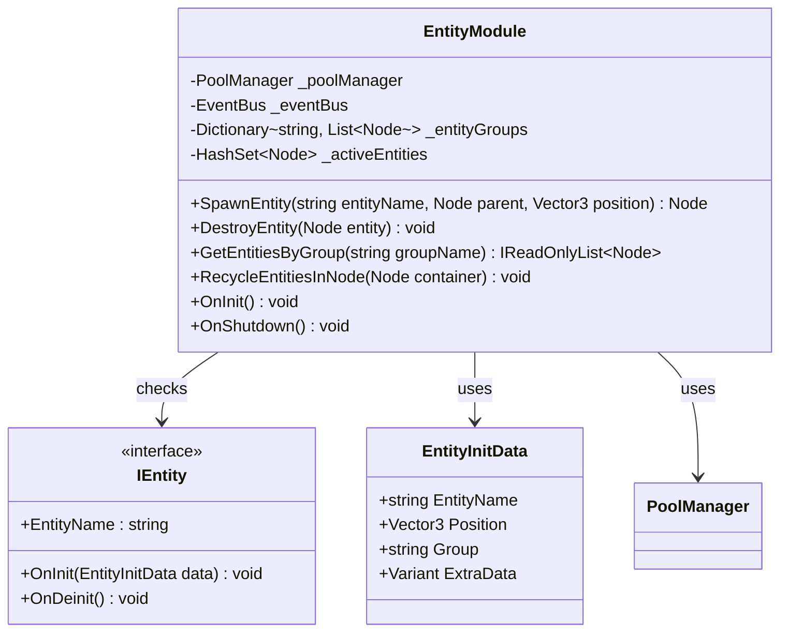
```mermaid
classDiagram
    class IEntity {
        <<interface>>
        +EntityName : string
        +OnInit(EntityInitData data) void
        +OnDeinit() void
    }

    class EntityInitData {
        +string EntityName
        +Vector3 Position
        +string Group
        +Variant ExtraData
    }

    class EntityModule {
        -PoolManager _poolManager
        -EventBus _eventBus
        -Dictionary~string, List~Node~~ _entityGroups
        -HashSet~Node~ _activeEntities
        +SpawnEntity(string entityName, Node parent, Vector3 position) Node
        +DestroyEntity(Node entity) void
        +GetEntitiesByGroup(string groupName) IReadOnlyList~Node~
        +RecycleEntitiesInNode(Node container) void
        +OnInit() void
        +OnShutdown() void
    }

    EntityModule --> IEntity : checks
    EntityModule --> EntityInitData : uses
    EntityModule --> PoolManager : uses
```

**类定义**：

```csharp
// LynxFramework/Entity/IEntity.cs
public interface IEntity : IPoolableObject
{
    string EntityName { get; }
    void OnInit(EntityInitData data);
    void OnDeinit();
}

// LynxFramework/Entity/EntityInitData.cs
public class EntityInitData
{
    public string EntityName { get; set; }
    public Vector3 Position { get; set; }
    public string Group { get; set; }
    public Variant ExtraData { get; set; }
}

// LynxFramework/Entity/EntityModule.cs
public class EntityModule : IModule
{
    private PoolManager _poolManager;
    private EventBus _eventBus;
    private readonly Dictionary<string, List<Node>> _entityGroups = new();
    private readonly HashSet<Node> _activeEntities = new();

    public int Priority => 150;

    public void OnInit()
    {
        _poolManager = FrameworkEntry.Instance.GetModule<PoolManager>();
        _eventBus = FrameworkEntry.Instance.GetModule<EventBus>();
    }

    public void OnShutdown()
    {
        foreach (var entity in _activeEntities)
            entity.QueueFree();
        _activeEntities.Clear();
        _entityGroups.Clear();
    }

    public Node SpawnEntity(string entityName, Node parent, Vector3 position = default)
    {
        // 优先从对象池获取
        var entity = _poolManager?.GetNode(entityName, parent);
        if (entity == null)
        {
            // 兜底直接实例化
            var scenePath = $"res://entities/{entityName}.tscn";
            var scene = GD.Load<PackedScene>(scenePath);
            if (scene == null) return null;
            entity = scene.Instantiate();
            parent?.AddChild(entity);
        }

        // 设置位置
        if (entity is Node2D node2D)
            node2D.Position = new Vector2(position.X, position.Y);
        else if (entity is Node3D node3D)
            node3D.Position = position;

        // 初始化
        if (entity is IEntity iEntity)
        {
            var data = new EntityInitData { EntityName = entityName, Position = position };
            iEntity.OnInit(data);
        }

        _activeEntities.Add(entity);

        // 分组
        if (entity is IEntity e && !string.IsNullOrEmpty(e.EntityName))
        {
            if (!_entityGroups.ContainsKey(e.EntityName))
                _entityGroups[e.EntityName] = new List<Node>();
            _entityGroups[e.EntityName].Add(entity);
        }

        _eventBus?.Emit("entity_spawned", new EntityEventArg { Entity = entity, EntityName = entityName });
        return entity;
    }

    public void DestroyEntity(Node entity)
    {
        if (!_activeEntities.Remove(entity)) return;

        if (entity is IEntity iEntity)
            iEntity.OnDeinit();

        // 从分组中移除
        foreach (var group in _entityGroups.Values)
            group.Remove(entity);

        _poolManager?.RecycleNode(entity);
        _eventBus?.Emit("entity_destroyed", new EntityEventArg { EntityName = entity.Name });
    }

    public IReadOnlyList<Node> GetEntitiesByGroup(string groupName)
        => _entityGroups.TryGetValue(groupName, out var list) ? list : (IReadOnlyList<Node>)Array.Empty<Node>();

    public void RecycleEntitiesInNode(Node container)
    {
        foreach (var child in container.GetChildren())
        {
            if (_activeEntities.Contains(child))
                DestroyEntity(child);
        }
    }
}

public partial class EntityEventArg : EventArg
{
    public Node Entity { get; set; }
    public string EntityName { get; set; }
}
```

### 9.2 ProcedureModule

```mermaid
classDiagram
    class IProcedure {
        <<interface>>
        +OnEnter() void
        +OnUpdate(float delta) void
        +OnLeave() void
    }

    class ProcedureModule {
        -EventBus _eventBus
        -IProcedure _current
        -string _currentProcedureName
        -Dictionary~string, Func~IProcedure~~ _procedures
        -UpdateEntry _updateEntry
        +RegisterProcedure(string name, Func~IProcedure~ factory) void
        +SetCurrentProcedure(string procName) void
        +GetCurrentProcedure() IProcedure
        +GetCurrentProcedureName() string
        +OnInit() void
        +OnShutdown() void
    }

    ProcedureModule --> IProcedure : manages
```

**类定义**：

```csharp
// LynxFramework/Procedure/IProcedure.cs
public interface IProcedure
{
    void OnEnter();
    void OnUpdate(float delta);
    void OnLeave();
}

// LynxFramework/Procedure/ProcedureModule.cs
public class ProcedureModule : IModule
{
    private EventBus _eventBus;
    private IProcedure _current;
    private string _currentProcedureName;
    private readonly Dictionary<string, Func<IProcedure>> _procedures = new();
    private UpdateEntry _updateEntry;

    public int Priority => 170;

    public void OnInit()
    {
        _eventBus = FrameworkEntry.Instance.GetModule<EventBus>();
        var updateDriver = FrameworkEntry.Instance.GetModule<UpdateDriver>();
        _updateEntry = updateDriver.Register(UpdatePhase.Process, 0, OnUpdate);
    }

    public void OnShutdown()
    {
        _current?.OnLeave();
        _current = null;
        _updateEntry?.Callback = null;
    }

    public void RegisterProcedure(string name, Func<IProcedure> factory)
        => _procedures[name] = factory;

    public void SetCurrentProcedure(string procName)
    {
        if (!_procedures.TryGetValue(procName, out var factory)) return;

        // 离开当前流程
        _current?.OnLeave();

        // 进入新流程
        _current = factory();
        _currentProcedureName = procName;
        _current.OnEnter();

        _eventBus?.Emit("procedure_changed", new ProcedureEventArg
        {
            ProcedureName = procName
        });
    }

    public IProcedure GetCurrentProcedure() => _current;
    public string GetCurrentProcedureName() => _currentProcedureName;

    private void OnUpdate(float delta) => _current?.OnUpdate(delta);
}

public partial class ProcedureEventArg : EventArg
{
    public string ProcedureName { get; set; }
}
```

---

## 10. 摄像机

### 10.1 CameraModule

```mermaid
classDiagram
    class CameraShakeConfig {
        +float Trauma
        +float Duration
        +float Decay
    }

    class CameraModule {
        -EventBus _eventBus
        -Camera2D _camera2D
        -Camera3D _camera3D
        -Node _currentTarget
        -float _smoothingSpeed
        -float _shakeTrauma
        -float _shakeDecay
        -double _shakeEndTime
        -UpdateEntry _updateEntry
        +SetActiveCamera(Camera2D camera) void
        +SetActiveCamera(Camera3D camera) void
        +FollowTarget(Node target, float smoothingSpeed) void
        +Shake(float trauma, float duration, float decay) void
        +BlendTo(Camera2D camera, float time) void
        +BlendTo(Camera3D camera, float time) void
        +OnInit() void
        +OnShutdown() void
    }

    CameraModule --> CameraShakeConfig : uses
```

**类定义**：

```csharp
// LynxFramework/Camera/CameraModule.cs
public class CameraModule : IModule
{
    private EventBus _eventBus;
    private Camera2D _camera2D;
    private Camera3D _camera3D;
    private Node _currentTarget;
    private float _smoothingSpeed = 5f;
    private float _shakeTrauma;
    private float _shakeDecay = 5f;
    private double _shakeEndTime;
    private UpdateEntry _updateEntry;

    public int Priority => 140;

    public void OnInit()
    {
        _eventBus = FrameworkEntry.Instance.GetModule<EventBus>();
        var updateDriver = FrameworkEntry.Instance.GetModule<UpdateDriver>();
        _updateEntry = updateDriver.Register(UpdatePhase.Process, -100, OnUpdate);
    }

    public void OnShutdown() => _updateEntry?.Callback = null;

    public void SetActiveCamera(Camera2D camera) => _camera2D = camera;
    public void SetActiveCamera(Camera3D camera) => _camera3D = camera;

    public void FollowTarget(Node target, float smoothingSpeed = 5f)
    {
        _currentTarget = target;
        _smoothingSpeed = smoothingSpeed;
    }

    public void Shake(float trauma, float duration, float decay = 5f)
    {
        _shakeTrauma = trauma;
        _shakeDecay = decay;
        _shakeEndTime = Time.GetTicksMsec() / 1000.0 + duration;
    }

    public void BlendTo(Camera2D camera, float time)
    {
        // 禁用当前，启用目标
        if (_camera2D != null) _camera2D.Enabled = false;
        _camera2D = camera;
        _camera2D.Enabled = true;
        // 可扩展 Tween 过渡
    }

    public void BlendTo(Camera3D camera, float time)
    {
        if (_camera3D != null) _camera3D.Current = false;
        _camera3D = camera;
        _camera3D.Current = true;
    }

    private void OnUpdate(float delta)
    {
        // 跟随目标
        if (_currentTarget != null)
        {
            if (_camera2D != null && _currentTarget is Node2D target2D)
            {
                var targetPos = target2D.GlobalPosition;
                _camera2D.Position = _camera2D.Position.Lerp(targetPos, _smoothingSpeed * delta);
            }
            else if (_camera3D != null && _currentTarget is Node3D target3D)
            {
                var targetPos = target3D.GlobalPosition;
                _camera3D.Position = _camera3D.Position.Lerp(targetPos, _smoothingSpeed * delta);
            }
        }

        // 摄像机震动
        if (_shakeTrauma > 0)
        {
            var now = Time.GetTicksMsec() / 1000.0;
            if (now > _shakeEndTime)
            {
                _shakeTrauma = 0;
                ApplyShakeOffset(Vector2.Zero);
            }
            else
            {
                _shakeTrauma = Mathf.Max(0, _shakeTrauma - _shakeDecay * delta);
                var offsetX = _shakeTrauma * _shakeTrauma * (GD.Randf() * 2 - 1) * 10f;
                var offsetY = _shakeTrauma * _shakeTrauma * (GD.Randf() * 2 - 1) * 10f;
                ApplyShakeOffset(new Vector2(offsetX, offsetY));
            }
        }
    }

    private void ApplyShakeOffset(Vector2 offset)
    {
        if (_camera2D != null)
            _camera2D.Offset = offset;
        // 3D 摄像机通过 H/V 偏移实现
        if (_camera3D != null)
            _camera3D.HOffset = offset.X;
            _camera3D.VOffset = offset.Y;
    }
}
```

---

## 11. 存档系统

### 11.1 SaveModule

```mermaid
classDiagram
    class ISaveMigration {
        <<interface>>
        +FromVersion : int
        +ToVersion : int
        +Migrate(Dictionary data) Dictionary
    }

    class SaveSlotInfo {
        +int SlotIndex
        +string SaveTime
        +int DataVersion
        +Dictionary MetaData
    }

    class SaveModule {
        -LogService _logService
        -EventBus _eventBus
        -List~ISaveMigration~ _migrations
        -int _currentVersion
        +Save(string slotKey, int slotIndex, Dictionary data) void
        +Load(string slotKey, int slotIndex) Dictionary
        +Delete(string slotKey, int slotIndex) void
        +GetSlotsInfo(string slotKey) List~SaveSlotInfo~
        +RegisterMigration(ISaveMigration migration) void
        +SetCurrentVersion(int version) void
        +OnInit() void
        +OnShutdown() void
    }

    SaveModule --> ISaveMigration : manages
    SaveModule --> SaveSlotInfo : returns
```

**类定义**：

```csharp
// LynxFramework/Save/ISaveMigration.cs
public interface ISaveMigration
{
    int FromVersion { get; }
    int ToVersion { get; }
    Dictionary Migrate(Dictionary data);
}

// LynxFramework/Save/SaveModule.cs
public class SaveModule : IModule
{
    private LogService _logService;
    private EventBus _eventBus;
    private readonly List<ISaveMigration> _migrations = new();
    private int _currentVersion = 1;
    private readonly string _saveDir = "user://saves/";

    public int Priority => 180;

    public void OnInit()
    {
        _logService = FrameworkEntry.Instance.GetModule<LogService>();
        _eventBus = FrameworkEntry.Instance.GetModule<EventBus>();
        DirAccess.MakeDirRecursiveAbsolute(_saveDir);
    }

    public void OnShutdown() { }

    public void Save(string slotKey, int slotIndex, Dictionary data)
    {
        data["_version"] = _currentVersion;
        data["_save_time"] = DateTime.Now.ToString("O");

        var filePath = GetFilePath(slotKey, slotIndex);
        var file = FileAccess.Open(filePath, FileAccess.ModeFlags.Write);
        if (file == null)
        {
            _logService?.Error($"Save failed: {FileAccess.GetOpenError()}");
            return;
        }

        var json = Json.Stringify(data, "\t");
        file.StoreString(json);
        file.Close();

        _eventBus?.Emit("save_completed", new SaveEventArg { SlotKey = slotKey, SlotIndex = slotIndex });
    }

    public Dictionary Load(string slotKey, int slotIndex)
    {
        var filePath = GetFilePath(slotKey, slotIndex);
        if (!FileAccess.FileExists(filePath)) return null;

        var file = FileAccess.Open(filePath, FileAccess.ModeFlags.Read);
        if (file == null) return null;

        var json = file.GetAsText();
        file.Close();

        var result = Json.ParseString(json);
        if (result.VariantType != Variant.Type.Dictionary) return null;

        var data = new Dictionary(result.AsGodotDictionary());

        // 版本迁移
        var version = data.GetValueOrDefault("_version", 1).AsInt32();
        if (version < _currentVersion)
            data = MigrateData(data, version);

        return data;
    }

    public void Delete(string slotKey, int slotIndex)
    {
        var filePath = GetFilePath(slotKey, slotIndex);
        DirAccess.RemoveAbsolute(filePath);
    }

    public List<SaveSlotInfo> GetSlotsInfo(string slotKey)
    {
        var result = new List<SaveSlotInfo>();
        var dir = DirAccess.Open(_saveDir);
        if (dir == null) return result;

        dir.ListDirBegin();
        var fileName = dir.GetNext();
        while (fileName != string.Empty)
        {
            if (fileName.StartsWith(slotKey) && fileName.EndsWith(".sav"))
            {
                // 解析槽位信息
                result.Add(ParseSlotInfo(fileName));
            }
            fileName = dir.GetNext();
        }
        dir.ListDirEnd();
        return result;
    }

    public void RegisterMigration(ISaveMigration migration) => _migrations.Add(migration);
    public void SetCurrentVersion(int version) => _currentVersion = version;

    private Dictionary MigrateData(Dictionary data, int fromVersion)
    {
        var currentVersion = fromVersion;
        while (currentVersion < _currentVersion)
        {
            var migration = _migrations.Find(m => m.FromVersion == currentVersion);
            if (migration == null)
            {
                _logService?.Warning($"No migration from v{currentVersion} to v{currentVersion + 1}");
                break;
            }
            data = migration.Migrate(data);
            currentVersion = migration.ToVersion;
        }
        return data;
    }

    private string GetFilePath(string slotKey, int slotIndex)
        => $"{_saveDir}{slotKey}_{slotIndex}.sav";

    private SaveSlotInfo ParseSlotInfo(string fileName) => new();
}

public struct SaveSlotInfo
{
    public int SlotIndex;
    public string SaveTime;
    public int DataVersion;
    public Dictionary MetaData;
}

public partial class SaveEventArg : EventArg
{
    public string SlotKey { get; set; }
    public int SlotIndex { get; set; }
}
```

---

## 12. 调试与热更新

### 12.1 DebugModule

```mermaid
classDiagram
    class DebugModule {
        -EventBus _eventBus
        -LogService _logService
        -PoolManager _poolManager
        -Dictionary~string, Action~ _commands
        -Dictionary~string, Func~float~~ _stats
        -Control _debugPanel
        -bool _isVisible
        +ShowDebugUI() void
        +HideDebugUI() void
        +ToggleDebugUI() void
        +RegisterCommand(string name, Action~string[]~ callback) void
        +ExecuteCommand(string cmdString) void
        +RegisterStat(string statName, Func~float~ provider) void
        +UnregisterStat(string statName) void
        +GetStats() Dictionary~string, float~
        +OnInit() void
        +OnShutdown() void
    }
```

**类定义**：

> **实现说明**：DebugModule 不继承 GodotObject，因此不能使用 Godot 的 `Callable`。
> 改用 C# 原生委托 `Action<string[]>`（命令）和 `Func<float>`（统计），避免类型转换问题。

```csharp
// LynxFramework/Debug/DebugModule.cs
public class DebugModule : IModule
{
    private EventBus _eventBus;
    private LogService _logService;
    private PoolManager _poolManager;
    private readonly Dictionary<string, Action<string[]>> _commands = new();
    private readonly Dictionary<string, Func<float>> _stats = new();
    private Control _debugPanel;
    private bool _isVisible;

    public int Priority => 190;

    public void OnInit()
    {
        _eventBus = FrameworkEntry.Instance.GetModule<EventBus>();
        _logService = FrameworkEntry.Instance.GetModule<LogService>();
        _poolManager = FrameworkEntry.Instance.GetModule<PoolManager>();
        RegisterBuiltinCommands();
        RegisterBuiltinStats();
    }

    public void OnShutdown()
    {
        _debugPanel?.QueueFree();
        _commands.Clear();
        _stats.Clear();
    }

    public void ShowDebugUI()
    {
        if (_debugPanel == null) CreateDebugPanel();
        _debugPanel.Visible = true;
        _isVisible = true;
    }

    public void HideDebugUI()
    {
        if (_debugPanel != null) _debugPanel.Visible = false;
        _isVisible = false;
    }

    public void ToggleDebugUI()
    {
        if (_isVisible) HideDebugUI(); else ShowDebugUI();
    }

    public void RegisterCommand(string name, Action<string[]> callback) => _commands[name] = callback;

    public void ExecuteCommand(string cmdString)
    {
        var parts = cmdString.Split(' ');
        var cmdName = parts[0];
        var args = parts.Length > 1 ? parts[1..] : Array.Empty<string>();

        if (_commands.TryGetValue(cmdName, out var callback))
            callback(args);
        else
            _logService?.Warning($"Unknown command: {cmdName}");
    }

    public void RegisterStat(string statName, Func<float> provider) => _stats[statName] = provider;
    public void UnregisterStat(string statName) => _stats.Remove(statName);

    public Dictionary<string, float> GetStats()
    {
        var result = new Dictionary<string, float>();
        foreach (var kv in _stats)
        {
            try { result[kv.Key] = kv.Value(); }
            catch { result[kv.Key] = 0f; }
        }
        return result;
    }

    public bool IsVisible => _isVisible;

    private void RegisterBuiltinCommands()
    {
        RegisterCommand("help", CmdHelp);
        RegisterCommand("pool_stats", CmdPoolStats);
        RegisterCommand("fps", CmdFPS);
    }

    private void RegisterBuiltinStats()
    {
        RegisterStat("fps", StatFPS);
        RegisterStat("frame_time", StatFrameTime);
        RegisterStat("object_count", StatObjectCount);
    }

    private void CmdHelp(string[] args)
    {
        _logService?.Info("Available commands:");
        foreach (var cmd in _commands.Keys)
            _logService?.Info($"  {cmd}");
    }

    private void CmdPoolStats(string[] args)
    {
        var stats = _poolManager?.GetPoolStats();
        if (stats == null || stats.Count == 0) { _logService?.Info("No node pools active."); return; }
        foreach (var kv in stats)
            _logService?.Info($"  {kv.Key}: active={kv.Value.ActiveCount}, available={kv.Value.AvailableCount}, hitRate={kv.Value.HitRate:P}");
    }

    private void CmdFPS(string[] args) => _logService?.Info($"FPS: {Engine.GetFramesPerSecond()}");

    private float StatFPS() => (float)Engine.GetFramesPerSecond();
    private float StatFrameTime() => 1000f / Mathf.Max(1f, (float)Engine.GetFramesPerSecond());
    private float StatObjectCount() => (float)Performance.GetMonitor(Performance.Monitor.ObjectCount);

    private void CreateDebugPanel()
    {
        _debugPanel = new Control { Name = "DebugPanel" };
        var canvasLayer = new CanvasLayer { Name = "DebugLayer", Layer = 999 };
        canvasLayer.AddChild(_debugPanel);
        FrameworkEntry.Instance.AddChild(canvasLayer);
    }
}
```

### 12.2 HotUpdateModule

```mermaid
classDiagram
    class HotUpdateModule {
        -ResourceService _resourceService
        -LogService _logService
        -EventBus _eventBus
        -string _currentVersion
        -string _latestVersion
        -string _downloadPath
        -string _backupPath
        -bool _rollbackFlag
        +CheckUpdate() void
        +DownloadUpdate(Action~float~ progress) void
        +ApplyUpdate() void
        +RecoverLastVersion() void
        +GetCurrentVersion() string
        +OnInit() void
        +OnShutdown() void
    }
```

**类定义**：

```csharp
// LynxFramework/HotUpdate/HotUpdateModule.cs
public class HotUpdateModule : IModule
{
    private ResourceService _resourceService;
    private LogService _logService;
    private EventBus _eventBus;
    private string _currentVersion = "1.0.0";
    private string _latestVersion;
    private readonly string _downloadPath = "user://hotupdate/";
    private readonly string _backupPath = "user://hotupdate/backup/";
    private readonly string _rollbackFlagPath = "user://hotupdate/rollback_flag";

    public int Priority => 200;

    public void OnInit()
    {
        _resourceService = FrameworkEntry.Instance.GetModule<ResourceService>();
        _logService = FrameworkEntry.Instance.GetModule<LogService>();
        _eventBus = FrameworkEntry.Instance.GetModule<EventBus>();

        DirAccess.MakeDirRecursiveAbsolute(_downloadPath);
        DirAccess.MakeDirRecursiveAbsolute(_backupPath);
    }

    public void OnShutdown() { }

    public void CheckUpdate()
    {
        // 比对版本号（具体实现依赖版本检测策略，可热更）
        // 通过 HTTP 请求获取最新版本信息
        // 如果 _latestVersion > _currentVersion，通知有更新
    }

    public async void DownloadUpdate(Action<float> progress = null)
    {
        // 下载 .pck 文件到 _downloadPath
        // 支持断点续传
        var httpClient = new HttpRequest();
        FrameworkEntry.Instance.AddChild(httpClient);

        // ... 下载逻辑

        _eventBus?.Emit("hotupdate_download_complete", new HotUpdateEventArg
        {
            Version = _latestVersion
        });
    }

    public void ApplyUpdate()
    {
        var pckPath = $"{_downloadPath}patch_{_latestVersion}.pck";

        // 1. 备份当前版本
        BackupCurrentVersion();

        // 2. 写入回滚标记
        WriteRollbackFlag();

        // 3. 加载新 .pck
        _resourceService.SetPatchPack(pckPath);

        // 4. 清除回滚标记（应用成功）
        ClearRollbackFlag();

        _currentVersion = _latestVersion;
        _eventBus?.Emit("hotupdate_applied", new HotUpdateEventArg { Version = _currentVersion });
    }

    public void RecoverLastVersion()
    {
        // 从备份目录恢复上一个 .pck
        var backupFile = $"{_backupPath}patch_{_currentVersion}.pck.bak";
        if (FileAccess.FileExists(backupFile))
        {
            _resourceService.SetPatchPack(backupFile);
        }
        ClearRollbackFlag();
        _logService?.Info("Rollback to previous version completed.");
    }

    public string GetCurrentVersion() => _currentVersion;

    private void BackupCurrentVersion()
    {
        var currentPck = $"{_downloadPath}patch_{_currentVersion}.pck";
        if (FileAccess.FileExists(currentPck))
        {
            var backupFile = $"{_backupPath}patch_{_currentVersion}.pck.bak";
            DirAccess.CopyAbsolute(currentPck, backupFile);
        }
    }

    private void WriteRollbackFlag()
    {
        var file = FileAccess.Open(_rollbackFlagPath, FileAccess.ModeFlags.Write);
        file?.StoreString(_currentVersion);
        file?.Close();
    }

    private void ClearRollbackFlag() => DirAccess.RemoveAbsolute(_rollbackFlagPath);
}

public partial class HotUpdateEventArg : EventArg
{
    public string Version { get; set; }
}
```

---

## 13. 跨模块交互流程

### 13.1 游戏启动流程

```mermaid
sequenceDiagram
    participant Godot
    participant FE as FrameworkEntry
    participant MM as ModuleManager
    participant EB as EventBus
    participant RS as ResourceService
    participant GS as GameSettingsModule
    participant SM as SceneModule
    participant PROC as ProcedureModule

    Godot->>FE: _Ready()
    FE->>MM: InitAll()
    MM->>EB: OnInit()
    MM->>RS: OnInit()
    MM->>GS: OnInit()
    GS->>GS: Load() (从 SaveModule 读取设置)
    GS->>GS: Apply() (应用分辨率、音量等)
    MM->>SM: OnInit()
    MM->>PROC: OnInit()
    FE->>FE: EmitSignal framework_ready

    PROC->>PROC: SetCurrentProcedure("LaunchProcedure")
    PROC->>SM: SwitchToScene("res://scenes/main_menu.tscn")
```

### 13.2 热更新流程

```mermaid
sequenceDiagram
    participant PROC as ProcedureModule
    participant HU as HotUpdateModule
    participant RS as ResourceService
    participant EB as EventBus

    PROC->>HU: CheckUpdate()
    HU->>HU: 比对版本号
    HU->>EB: Emit("hotupdate_available")
    EB->>PROC: 收到更新事件，显示更新 UI

    PROC->>HU: DownloadUpdate(progress)
    HU->>EB: Emit("hotupdate_download_progress")
    HU->>EB: Emit("hotupdate_download_complete")

    PROC->>HU: ApplyUpdate()
    HU->>HU: BackupCurrentVersion()
    HU->>HU: WriteRollbackFlag()
    HU->>RS: SetPatchPack(pckPath)
    HU->>HU: ClearRollbackFlag()
    HU->>EB: Emit("hotupdate_applied")
```

### 13.3 UI 栈交互流程

```mermaid
sequenceDiagram
    participant Game as 游戏逻辑
    participant UI as UIModule
    participant Panel_A as Panel A (栈顶)
    participant Panel_B as Panel B (新开)

    Game->>UI: OpenUI("PanelB", data)
    UI->>Panel_A: OnCover()
    UI->>Panel_B: 实例化并添加到场景树
    UI->>Panel_B: OnOpen(data)
    Note over UI: Panel_A MouseFilter = Ignore

    Game->>UI: CloseUI("PanelB")
    UI->>Panel_B: OnClose()
    UI->>Panel_B: 播放关闭动画 → QueueFree
    UI->>Panel_A: OnResume()
    Note over UI: Panel_A MouseFilter = Stop
```

### 13.4 存档版本迁移流程

```mermaid
sequenceDiagram
    participant Game as 游戏逻辑
    participant SAVE as SaveModule
    participant M1 as Migration v1→v2
    participant M2 as Migration v2→v3

    Game->>SAVE: Load("game", 0)
    SAVE->>SAVE: 读取文件，解析 JSON
    SAVE->>SAVE: 检测 version = 1
    SAVE->>M1: Migrate(data) → version 2
    M1-->>SAVE: data v2
    SAVE->>M2: Migrate(data) → version 3
    M2-->>SAVE: data v3
    SAVE-->>Game: 返回迁移后的数据
```

---

## 13.5 C#/GDScript 桥接层

### 架构分工

```
┌─────────────────────────────────────────────────────────┐
│                   GDScript 业务层 (可热更)                 │
│  玩家逻辑 │ 敌人 AI │ UI 面板 │ 关卡脚本 │ 配置表读取       │
│  通过 FrameworkAPI.xxx() 调用框架功能                      │
├─────────────────────────────────────────────────────────┤
│                   C# 桥接层 (稳定)                        │
│  FrameworkBridge (静态方法) │ EventBusBridge (Callable)  │
│  FrameworkAPI.gd (GDScript 侧单例)                       │
├─────────────────────────────────────────────────────────┤
│                   C# 框架核心 (稳定不热更)                  │
│  FrameworkEntry │ ModuleManager │ EventBus │ 所有 Module   │
├─────────────────────────────────────────────────────────┤
│                   Godot Engine 4.6.3                      │
└─────────────────────────────────────────────────────────┘
```

### 桥接文件

| 文件 | 职责 |
|------|------|
| `Bridge/FrameworkBridge.cs` | C# 静态方法，暴露所有模块 API 给 GDScript |
| `Bridge/EventBusBridge.cs` | 将 GDScript Callable 包装为 C# Action |
| `Bridge/FrameworkAPI.gd` | GDScript 侧单例，提供 snake_case API |
| `Bridge/VariantEventArg.cs` | Variant 包装事件载荷，跨语言数据传递 |

### GDScript 使用方式

```gdscript
# 直接调用静态方法，无需获取模块实例
FrameworkAPI.log_info("Hello from GDScript")
FrameworkAPI.play_bgm("res://audio/bgm.ogg", 1.0)
FrameworkAPI.open_ui("Inventory")

# 事件订阅（返回 handler ID）
var id = FrameworkAPI.subscribe("enemy_killed", _on_enemy_killed)
FrameworkAPI.unsubscribe("enemy_killed", id)

# 带数据事件
FrameworkAPI.emit_variant("damage", {"amount": 50, "type": "fire"})
var id2 = FrameworkAPI.subscribe_variant("damage", _on_damage)

# 输入（支持缓冲）
if FrameworkAPI.consume_action("attack"):
    fire()

# 存档
FrameworkAPI.save_data("game", 0, {"level": 5})
var data = FrameworkAPI.load_data("game", 0)

# 数据表
var sword = FrameworkAPI.get_data_row("weapons", "sword_01")
```

### 热更边界

| 层级 | 语言 | 热更 | 文件位置 |
|------|------|------|----------|
| 框架核心 | C# | ❌ | `src/lynx-framework/` |
| 桥接层 | C# + GDScript | ❌ | `src/lynx-framework/Bridge/` |
| 游戏逻辑 | GDScript | ✅ | `scripts/` |
| UI 面板 | GDScript | ✅ | `scripts/ui/` |
| 关卡脚本 | GDScript | ✅ | `scripts/levels/` |
| 配置数据 | JSON/TRES | ✅ | `data/` |

---

## 14. 实现路线图

> **实现状态**：Phase 1-7 全部完成（2026-06-01）。

### Phase 1：核心骨架 ✅

| 序号 | 任务 | 优先级 | 状态 |
|------|------|--------|------|
| 1.1 | IModule 接口 + ModuleManager | P0 | ✅ |
| 1.2 | EventBus（含类型安全载荷 EventArg） | P0 | ✅ |
| 1.3 | UpdateDriver | P0 | ✅ |
| 1.4 | LogService | P0 | ✅ |
| 1.5 | FrameworkEntry（Autoload 注册 + 启动流程） | P0 | ✅ |
| 1.6 | 基础测试场景验证启动流程 | P0 | ✅ |

### Phase 2：资源与对象管理 ✅

| 序号 | 任务 | 优先级 | 状态 |
|------|------|--------|------|
| 2.1 | PoolManager（节点池 + 普通对象池） | P0 | ✅ |
| 2.2 | ResourceService（同步加载 + 缓存） | P0 | ✅ |
| 2.3 | ResourceService（异步加载 + .pck 热更） | P1 | ✅ |
| 2.4 | 对象池命中率统计 + 测试 | P1 | ✅ |

### Phase 3：场景与 UI ✅

| 序号 | 任务 | 优先级 | 状态 |
|------|------|--------|------|
| 3.1 | SceneModule（异步加载/卸载） | P0 | ✅ |
| 3.2 | SceneModule（转场动画 ISceneTransition） | P1 | ✅ |
| 3.3 | UIModule（栈管理 + IUIPanel 生命周期） | P0 | ✅ |
| 3.4 | UIModule（IUITransition 过渡动画） | P1 | ✅ |
| 3.5 | 集成测试：场景切换 + UI 栈操作 | P0 | ✅ |

### Phase 4：游戏逻辑基础设施 ✅

| 序号 | 任务 | 优先级 | 状态 |
|------|------|--------|------|
| 4.1 | ProcedureModule（FSM + IProcedure） | P0 | ✅ |
| 4.2 | EntityModule（生成/回收 + 池化） | P0 | ✅ |
| 4.3 | InputModule | P0 | ✅ |
| 4.4 | InputBufferModule | P1 | ✅ |
| 4.5 | CameraModule | P1 | ✅ |
| 4.6 | AudioModule | P1 | ✅ |

### Phase 5：数据与配置 ✅

| 序号 | 任务 | 优先级 | 状态 |
|------|------|--------|------|
| 5.1 | DataTableModule | P1 | ✅ |
| 5.2 | GameSettingsModule | P1 | ✅ |
| 5.3 | LocalizationModule | P1 | ✅ |
| 5.4 | SaveModule（基础读写） | P0 | ✅ |
| 5.5 | SaveModule（版本迁移） | P1 | ✅ |

### Phase 6：网络与高级功能 ✅

| 序号 | 任务 | 优先级 | 状态 |
|------|------|--------|------|
| 6.1 | NetworkModule（TCP 连接 + 重连） | P1 | ✅ |
| 6.2 | NetworkModule（IProtocolHandler） | P2 | ✅ |
| 6.3 | WorldStreamingModule | P2 | ✅ |
| 6.4 | DebugModule | P2 | ✅ |
| 6.5 | HotUpdateModule | P2 | ✅ |

### Phase 7：集成测试与文档 ✅

| 序号 | 任务 | 优先级 | 状态 |
|------|------|--------|------|
| 7.1 | 全模块集成测试场景 | P0 | ✅ |
| 7.2 | 性能基准测试 | P1 | ✅ |
| 7.3 | API 文档生成 | P1 | ✅ |
| 7.4 | 示例项目 | P2 | ✅ |

---

## 附录 A：事件 ID 命名规范

| 模块 | 事件 ID | 载荷类型 | 说明 |
|------|---------|---------|------|
| 通用 | `framework_ready` | 无 | 框架初始化完成 |
| 设置 | `settings_changed` | SettingsChangedEventArg | 设置项变更 |
| 本地化 | `language_changed` | LanguageChangedEventArg | 语言切换 |
| 场景 | `scene_loaded` | SceneEventArg | 场景加载完成 |
| 场景 | `scene_unloaded` | SceneEventArg | 场景卸载完成 |
| UI | `ui_opened` | UIEventArg | UI 面板打开 |
| UI | `ui_closed` | UIEventArg | UI 面板关闭 |
| 输入 | `input_remap` | InputRemapEventArg | 键位重映射 |
| 实体 | `entity_spawned` | EntityEventArg | 实体生成 |
| 实体 | `entity_destroyed` | EntityEventArg | 实体销毁 |
| 流程 | `procedure_changed` | ProcedureEventArg | 流程切换 |
| 存档 | `save_completed` | SaveEventArg | 存档完成 |
| 网络 | `network_data_received` | NetworkDataEventArg | 网络数据到达 |
| 网络 | `network_state_changed` | NetworkStateEventArg | 连接状态变更 |
| 热更 | `hotupdate_available` | HotUpdateEventArg | 检测到更新 |
| 热更 | `hotupdate_download_complete` | HotUpdateEventArg | 下载完成 |
| 热更 | `hotupdate_applied` | HotUpdateEventArg | 更新已应用 |

## 附录 B：EventArg 事件载荷定义汇总

```csharp
// 所有事件载荷均继承 EventArg (Resource 子类)
// 文件统一放置于 LynxFramework/Events/ 目录

public partial class SettingsChangedEventArg : EventArg { public string Key; public Variant Value; }
public partial class LanguageChangedEventArg : EventArg { public string Language; }
public partial class SceneEventArg : EventArg { public string ScenePath; }
public partial class UIEventArg : EventArg { public string UIName; }
public partial class InputRemapEventArg : EventArg { public string Action; public InputEvent Event; }
public partial class EntityEventArg : EventArg { public Node Entity; public string EntityName; }
public partial class ProcedureEventArg : EventArg { public string ProcedureName; }
public partial class SaveEventArg : EventArg { public string SlotKey; public int SlotIndex; }
public partial class NetworkDataEventArg : EventArg { public byte[] Data; }
public partial class NetworkStateEventArg : EventArg { public ConnectionState State; }
public partial class HotUpdateEventArg : EventArg { public string Version; }
```

---

## 附录 C：实际实现文件清单

> **实现日期**：2026-06-01
> **引擎版本**：Godot 4.6.3 / .NET 8
> **源文件总数**：65 个 C# 文件

```
src/lynx-framework/
├── IModule.cs                          # 模块接口
├── FrameworkEntry.cs                   # Autoload 单例，框架启动入口
├── Core/
│   ├── ModuleManager.cs                # 模块注册/查询/生命周期管理
│   ├── EventBus.cs                     # 高性能全局事件总线（延迟队列）
│   └── UpdateDriver.cs                 # 统一主循环调度器（脏标记排序）
├── Events/
│   └── EventArg.cs                     # 事件载荷基类（Godot.Resource 子类）
├── Log/
│   ├── LogLevel.cs                     # 日志级别枚举
│   ├── ILogOutput.cs                   # 日志输出接口
│   ├── ConsoleLogOutput.cs             # 控制台输出（GD.Print/Warning/Error）
│   └── LogService.cs                   # 日志服务（多输出目标、级别过滤）
├── Pool/
│   ├── IPoolableObject.cs              # 可池化对象接口
│   ├── PoolStat.cs                     # 池统计信息结构
│   ├── NodePool.cs                     # 节点池（PackedScene 复用）
│   ├── ObjectPool.cs                   # 泛型对象池（C# 对象复用）
│   └── PoolManager.cs                  # 池管理器模块
├── Resource/
│   ├── ResourceRequest.cs              # 异步加载请求（进度跟踪）
│   └── ResourceService.cs              # 资源服务（同步/异步/缓存/.pck）
├── Scene/
│   ├── ISceneTransition.cs             # 转场动画接口
│   ├── FadeTransition.cs               # 淡入淡出转场实现
│   ├── SceneEventArg.cs                # 场景事件载荷
│   └── SceneModule.cs                  # 场景管理（加载/卸载/栈/转场）
├── UI/
│   ├── IUIPanel.cs                     # UI 面板生命周期接口
│   ├── UIOpenParam.cs                  # 打开参数
│   ├── IUITransition.cs                # UI 过渡动画接口
│   ├── UIStackEntry.cs                 # 栈条目
│   ├── UIEventArg.cs                   # UI 事件载荷
│   └── UIModule.cs                     # UI 栈管理（输入拦截/生命周期）
├── Procedure/
│   ├── IProcedure.cs                   # 流程接口（FSM 状态）
│   ├── ProcedureEventArg.cs            # 流程事件载荷
│   └── ProcedureModule.cs              # 流程 FSM 模块
├── Entity/
│   ├── IEntity.cs                      # 实体接口（继承 IPoolableObject）
│   ├── EntityInitData.cs               # 实体初始化数据
│   ├── EntityEventArg.cs               # 实体事件载荷
│   └── EntityModule.cs                 # 实体管理（生成/回收/分组）
├── Input/
│   ├── InputModule.cs                  # 输入管理（启用/禁用/重映射）
│   ├── InputRemapEventArg.cs           # 键位重映射事件
│   ├── BufferedAction.cs               # 缓冲动作结构
│   └── InputBufferModule.cs            # 输入缓冲（时间窗口消费）
├── Camera/
│   └── CameraModule.cs                 # 摄像机（跟随/震动/混合）
├── Audio/
│   └── AudioModule.cs                  # 音频（BGM 淡入淡出/SFX 池/音量）
├── Data/
│   ├── DataTable.cs                    # 数据表结构
│   └── DataTableModule.cs              # 数据表管理（JSON 加载/查询）
├── Settings/
│   ├── SettingsChangedEventArg.cs      # 设置变更事件
│   └── GameSettingsModule.cs           # 游戏设置（注册/读写/持久化）
├── Localization/
│   ├── LanguageChangedEventArg.cs      # 语言切换事件
│   └── LocalizationModule.cs           # 本地化（TranslationServer 封装）
├── Save/
│   ├── ISaveMigration.cs               # 存档迁移接口
│   ├── SaveSlotInfo.cs                 # 槽位信息
│   ├── SaveEventArg.cs                 # 存档事件
│   └── SaveModule.cs                   # 存档（读写/加密/版本迁移）
├── Network/
│   ├── ConnectionState.cs              # 连接状态枚举
│   ├── IProtocolHandler.cs             # 协议编解码接口
│   ├── NetworkEventArg.cs              # 网络事件载荷
│   └── NetworkModule.cs                # 网络（TCP/心跳/自动重连）
├── Streaming/
│   ├── IChunkStrategy.cs               # 区块加载策略接口
│   └── WorldStreamingModule.cs         # 世界流式加载
├── Debug/
│   └── DebugModule.cs                  # 调试（命令/统计/面板）
├── HotUpdate/
│   ├── HotUpdateEventArg.cs            # 热更新事件
│   └── HotUpdateModule.cs              # 热更新（下载/应用/回滚）
└── Tests/
    ├── FrameworkStartupTest.cs         # Phase 1 启动验证
    ├── Phase2Test.cs                   # Phase 2 池/资源验证
    ├── Phase3Test.cs                   # Phase 3 场景/UI 验证
    ├── Phase4Test.cs                   # Phase 4 游戏逻辑验证
    ├── Phase5Test.cs                   # Phase 5 数据/存档验证（含迁移测试）
    ├── FullIntegrationTest.cs          # 全模块集成测试（44 项断言）
    ├── Benchmarks/
    │   ├── BenchmarkTest.cs            # 性能基准测试（6 项）
    │   └── BenchmarkTestScene.tscn
    └── *.tscn                          # 各阶段测试场景
```

### 附录 D：示例项目

位于 `examples/arena-survival/`，演示 LynxFramework 的完整使用流程：

```
examples/arena-survival/
├── README.md
├── scripts/
│   ├── procedures/
│   │   ├── MenuProcedure.cs            # 菜单流程（场景加载/UI/BGM）
│   │   ├── GameplayProcedure.cs        # 游戏流程（实体生成/事件/输入缓冲）
│   │   └── GameOverProcedure.cs        # 结算流程（存档/UI）
│   ├── entities/
│   │   ├── Player.cs                   # 玩家（CharacterBody3D + IEntity）
│   │   ├── Enemy.cs                    # 敌人（对象池复用）
│   │   └── Bullet.cs                   # 子弹（NodePool 管理）
│   └── ui/
│       ├── HUD.cs                      # 游戏内 HUD（IUIPanel）
│       └── PauseMenu.cs               # 暂停菜单（输入禁用/恢复）
└── data/tables/
    ├── enemies.json                    # 敌人配置表
    └── weapons.json                    # 武器配置表
```

**演示的模块**：FrameworkEntry, EventBus, UpdateDriver, PoolManager, EntityModule,
ProcedureModule, InputModule, InputBufferModule, CameraModule, AudioModule,
UIModule, SaveModule, GameSettingsModule, DataTableModule

### 与设计文档的实现差异

| 模块 | 设计文档 | 实际实现 | 原因 |
|------|----------|----------|------|
| EventArg | `: Resource` | `: Godot.Resource` | 避免与 `LynxFramework.Resource` 命名空间冲突 |
| NetworkModule | `[Signal]` + `EmitSignal` | 仅用 EventBus | `IModule` 不继承 `GodotObject`，无法使用 Godot 信号 |
| NetworkModule | `PackedByteArray` | `byte[]` | Godot 4.x C# API 使用 `byte[]` 而非 GDScript 类型 |
| DebugModule | `Callable` | `Action<string[]>` / `Func<float>` | `DebugModule` 不继承 `GodotObject`，无法创建 `Callable` |
| ResourceService | `async/await` + `ToSignal` | `UpdateDriver` 轮询回调 | 避免跨帧 async 状态丢失 |
| ResourceService | `out var progressArray` | `new Godot.Collections.Array()` 参数 | Godot 4.x C# API 不使用 `out` |
| GameSettingsModule | `AsFloat()` | `AsSingle()` | Godot 4.x C# `Variant` API 命名 |
| DataTableModule | `Godot.Guid` | `System.Guid` | Godot 命名空间中无 `Guid` 类型 |
| SaveModule | `new Dictionary(dict)` | `dict.AsGodotDictionary()` | `Godot.Collections.Dictionary` 无单参数构造函数 |
| DebugModule | `Performance.GetMonitor()` → `float` | 显式 `(float)` 转换 | 返回值为 `double` |
